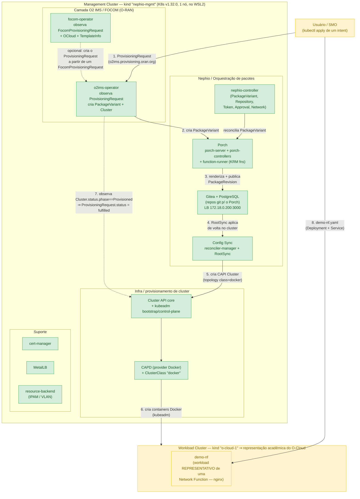

# 04 — Arquitetura do experimento (ETAPA 5)

> Diagramas baseados no que foi **realmente instalado** (ETAPA 3) e descoberto (ETAPA 4).
> Verde = instalado e saudável. Amarelo = alvo das ETAPAS 6/7. Cinza = fora do escopo.

---

## 1. Visão geral (componentes reais)



## 2. Cadeia de causa e efeito (o "fluxo ideal" alvo da ETAPA 7)

```mermaid
sequenceDiagram
    autonumber
    actor U as Usuário/SMO
    participant O2 as o2ims-operator
    participant PV as Porch (PackageVariant/Revision)
    participant GIT as Gitea (repo &quot;mgmt&quot;)
    participant CS as Config Sync (RootSync)
    participant CAPI as CAPI + CAPD
    participant OC as o-cloud-1 (containers)

    U->>O2: kubectl apply ProvisioningRequest<br/>(templateName=nephio-workload-cluster,<br/>templateParameters.clusterName=o-cloud-1)
    Note over O2: valida templateName/Version/Parameters + clusterName
    O2->>PV: cria PackageVariant<br/>upstream catalog-infra-capi/&lt;template&gt; → downstream mgmt/o-cloud-1
    PV->>GIT: renderiza e publica PackageRevision (auto-approve: policy=initial)
    GIT->>CS: RootSync(mgmt) detecta o commit
    CS->>CAPI: aplica CAPI Cluster &quot;o-cloud-1&quot; (class=docker) + DockerCluster + MachineDeployment
    CAPI->>OC: kubeadm cria control-plane + worker (containers Docker)
    OC-->>CAPI: Cluster.status.phase = Provisioned
    O2->>O2: poll Cluster.status.phase
    O2-->>U: ProvisioningRequest.status.provisioningState = fulfilled<br/>provisionedResourceSet.oCloudNodeClusterId = &lt;uuid&gt;
```

---

## 3. O que é cada peça

### Management Cluster (`nephio-mgmt`)
Cluster kind único (1 nó control-plane, K8s v1.32.0) rodando dentro do WSL2. Hospeda **toda** a
automação: Porch, controllers Nephio, Gitea, Config Sync, Cluster API + CAPD, e os operadores
O2 IMS / FOCOM. **Não** roda nenhuma NF. É o "cérebro" SMO do laboratório.

### O2 IMS (O-RAN O2 — Infrastructure Management Services)
No R6 é o par **`focom-operator` + `o2ims-operator`** + as CRDs
`FocomProvisioningRequest` / `ProvisioningRequest` / `OCloud` / `TemplateInfo`.
- **FOCOM** = função do **lado SMO** (Federated O-Cloud Orchestration & Management): recebe a
  intenção e a encaminha para o O-Cloud certo.
- **`ProvisioningRequest`** = a mensagem da **interface O2 IMS** propriamente dita
  (o que um SMO externo enviaria ao O-Cloud para pedir infraestrutura).
- O `o2ims-operator` **traduz** essa intenção em objetos Kubernetes concretos
  (`PackageVariant` → `Cluster` do Cluster API).
> É uma **PoC** do O2 IMS (o próprio README diz "work-in-progress in O-RAN standards"),
> não uma implementação O-RAN certificada.

### Workload Cluster (`o-cloud-1`)
Segundo cluster Kubernetes, leve, criado pelo Cluster API + provider Docker (CAPD) —
na prática, mais containers Docker rodando `kubeadm` dentro do mesmo host WSL2.

### O-Cloud
No O-RAN, o **O-Cloud** é a plataforma de nuvem (compute/rede/armazenamento) que hospeda as
funções de rede O-RAN, gerenciada via interface O2. **Neste experimento acadêmico**, o
`o-cloud-1` (um cluster kind) **representa** o O-Cloud: tem a mesma *forma* (um cluster
Kubernetes provisionado sob demanda por uma request de infraestrutura e registrado no SMO),
mas **sem** o hardware, a rede de transporte, o particionamento de recursos, o inventário O2
(DMS/IMS) nem a certificação O-RAN de um O-Cloud real. Usamos um workload cluster porque ele
é a menor coisa que reproduz o *ciclo* "intent → provisionamento → cluster gerenciado → workload"
dentro de 16 GB de RAM.

### Workload genérico × NF real
- **`demo-nf`** = um `Deployment` de `nginx` com `requests`/`limits` baixos. Serve **só** para
  exercitar mecanismos de *lifecycle* e *reconciliação*.
- Uma **NF O-RAN real** (O-DU, O-CU-CP/UP, Near-RT RIC, ou uma NF 5G como AMF/SMF/UPF) tem
  planos de controle/usuário, interfaces (E1/F1/E2/N2/N3…), dependências de kernel (SCTP, GTP-U,
  DPDK/SR-IOV), operadores dedicados e um ciclo de vida próprio (onboarding, healing, scaling
  orientado a KPI). **`demo-nf` não é, e não simula, nada disso.** No relatório ela é sempre
  chamada de *"workload representativo de uma Network Function"*.

---

## 4. Quatro "ciclos de vida" que NÃO se confundem

| Camada | Quem faz | O que significa aqui | Exemplo no lab |
|---|---|---|---|
| **Kubernetes lifecycle** | `kube-controller-manager` (ReplicaSet, Deployment) | manter réplicas = desejado; recriar Pod morto; rollout de nova versão | `kubectl scale`, deletar um Pod e ver outro nascer |
| **Nephio orchestration** | Porch + `nephio-controller` + Config Sync | versionar/renderizar **pacotes** (KRM), propagar via Git para clusters, aprovar revisões | `PackageVariant` → `PackageRevision` publicada no Gitea → aplicada por RootSync |
| **O2 IMS** | `focom-operator` + `o2ims-operator` | traduzir uma **request de infraestrutura** (padrão O-RAN O2) em provisionamento de cluster e reportar `provisioningState` | `ProvisioningRequest` → `Cluster` CAPI → `fulfilled` |
| **O-RAN NF lifecycle** | operadores de NF (fora do escopo) | onboarding/instanciação/healing/scaling **de funções O-RAN** guiado por KPIs e interfaces O-RAN | **não implementado** — `demo-nf` só imita o item 1 |

O laboratório demonstra **de fato** os itens 1, 2 e 3. O item 4 é apenas **nomeado** para
deixar claro o que ficou de fora.

---

## 5. Fronteira "O-RAN real" × "abstração de laboratório"

| Elemento | Real (padrão/upstream) | Abstração deste lab |
|---|---|---|
| CRD `ProvisioningRequest` / interface O2 | especificação O-RAN.WG6 (em rascunho) | operador **PoC** do Nephio; `oCloudNodeClusterId` = UUID aleatório |
| O-Cloud | plataforma de nuvem com HW, rede, inventário O2 (IMS+DMS) | um cluster **kind** provisionado por CAPD |
| FOCOM / SMO | função SMO federando múltiplos O-Clouds | operador rodando **no mesmo** cluster de management |
| Provisionamento de infra | ClusterAPI + provider de IaaS (OpenStack/metal/cloud) | ClusterAPI + provider **Docker** (containers) |
| Network Function | O-DU/O-CU/RIC/NF-5G com operadores e interfaces | `nginx` (`demo-nf`), "workload representativo" |
| GitOps / catálogo | repos Git reais, políticas de aprovação, multirregião | Gitea local, 1 repo `mgmt`, auto-approve |
| Observabilidade | SMO com coleta de KPI O1/O2, rApps/xApps | `kubectl get events` / `describe` / logs |
