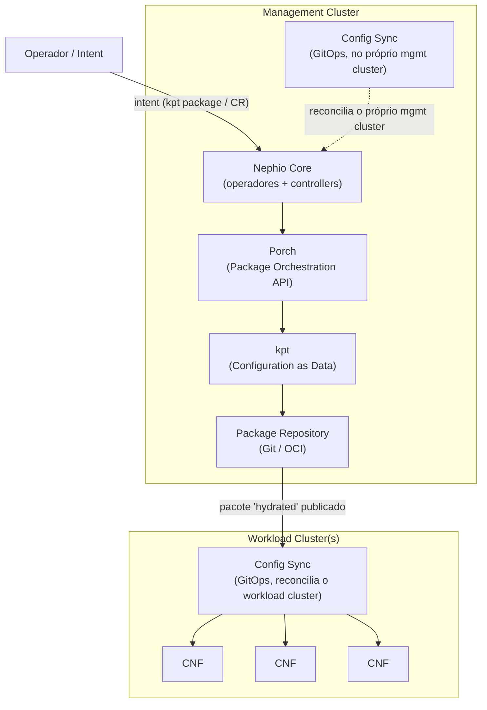
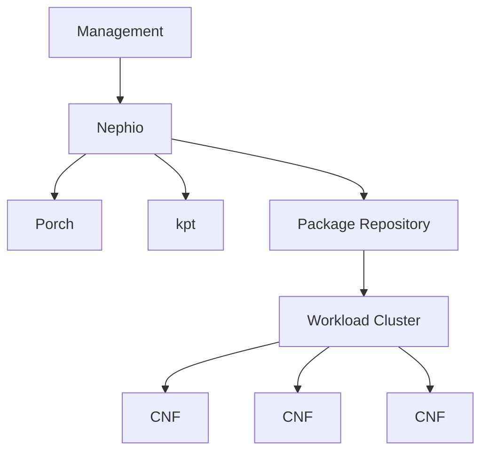
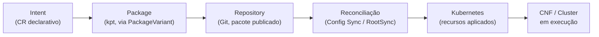

# Nephio — Arquitetura (Fase 2)

> Fontes: ver [`docs/references.md`](references.md) itens 1–11. Os diagramas de fluxo real
> (não apenas conceitual) estão em [`docs/04-architecture.md`](04-architecture.md), construídos
> a partir do laboratório prático já em execução.

---

## 1. O que é Nephio

**Nephio** é um projeto **graduado da Linux Foundation Networking** (nascido em 2022, colaboração
Linux Foundation + Google Cloud) que entrega *"carrier-grade, simple, open, Kubernetes-based
cloud native intent automation and common automation templates"* para simplificar a implantação
e o gerenciamento de infraestrutura de nuvem multi-fornecedor e de funções de rede em
implantações de borda de grande escala (LF, comunicado de lançamento — ref. 2).

Formulação que usamos neste trabalho, para não superestimar o escopo da ferramenta:

> **Nephio is a cloud-native automation and orchestration platform that can implement or
> support functions associated with the SMO and O-Cloud management architecture.**

Ou seja: Nephio não é *o* SMO da O-RAN, nem uma implementação certificada da especificação.
É uma **plataforma de automação declarativa genérica** (não específica de telecom em seu núcleo)
que o próprio projeto direciona, através de operadores e pacotes específicos, para casos de uso
de RAN e O-Cloud — ver Fase 3.

## 2. Qual problema o Nephio tenta resolver

Operadoras de telecom que adotam **Cloud-native Network Functions (CNFs)** enfrentam o problema
de **automatizar, em escala, o ciclo completo** — do provisionamento de infraestrutura de nuvem
ao deployment e configuração de centenas/milhares de instâncias de NF em sites distribuídos
(regional, edge) — de forma **declarativa, versionada e auditável**, evitando scripts ad-hoc e
processos manuais. O Nephio ataca isso com três pilares (LF, docs.nephio.org):

1. **Kubernetes como plano de controle universal** — tudo (infra, config, NF) é representado como
   recursos Kubernetes (CRDs), reconciliados por controllers.
2. **Configuration as Data (kpt/KRM)** — configuração tratada como dados manipuláveis
   programaticamente, não como texto opaco.
3. **GitOps** — o Git é a fonte de verdade; a reconciliação (Config Sync) traz o cluster ao
   estado declarado no repositório.

## 3. Arquitetura em alto nível

Versão simplificada (conforme solicitado):

## 4. Management Cluster

O cluster Kubernetes onde roda o **Nephio Core** — *"a collection of operators and functions
that perform the fundamental aspects of Nephio use cases"* (docs.nephio.org/architecture) —
junto com Porch, Config Sync (para reconciliar o próprio management cluster), Gitea/repositório
de pacotes, e, opcionalmente, Cluster API (para provisionar novos workload clusters) e os
operadores O2 IMS/FOCOM. É o "cérebro": não roda NFs de produção.

No nosso laboratório: cluster kind `nephio-mgmt`, K8s v1.32, single-node — ver
[`docs/02-nephio-installation.md`](02-nephio-installation.md).

## 5. Workload Cluster

Cluster(s) Kubernetes onde as **CNFs** de fato executam. Recebem configuração via GitOps
(Config Sync observando um repositório de *deployment*, já "hydrated" — pronto para
`kubectl apply`). Podem ser provisionados manualmente, via Cluster API, ou — no fluxo O2 IMS —
via `ProvisioningRequest` (ver [`docs/o1-o2-analysis.md`](o1-o2-analysis.md)).

No nosso laboratório: cluster kind `o-cloud-1`, K8s v1.31, 2 nós, **criado pelo próprio fluxo
Nephio/O2 IMS** (Cluster API + provider Docker) — não por `kind create cluster` manual. Ver
[`docs/05-experiment-report.md`](05-experiment-report.md) §6.

## 6. Porch (Package Orchestration)

Porch é descrito na documentação oficial como **"kpt-as-a-service"**: entrega *"opinionated
package management, manipulation, and lifecycle operations in a Kubernetes-based API"*
(docs.nephio.org/porch). Nasceu dentro do projeto kpt; quando o kpt foi doado à CNCF, o código
do Porch foi separado e doado ao Nephio.

Conceitos-chave (confirmados no nosso cluster real, ETAPA 3/6 do laboratório):
- **`Repository`** (`config.porch.kpt.dev`) — um repositório Git (ou OCI) registrado no Porch,
  marcado como *read-only* (catálogo/blueprint) ou *deployment* (destino de publicação).
- **`PackageRevision`** — uma revisão específica de um pacote kpt dentro de um repositório,
  com ciclo de vida `Draft → Proposed → Published`.
- **`PackageVariant`** — gera uma variação de um pacote upstream para um repositório/pacote
  downstream, aplicando mutators (ex.: `set-labels`, `apply-replacements`) — é o mecanismo que
  o operador O2 IMS usa para materializar um `ProvisioningRequest` em um pacote de cluster
  (ver `docs/03-o2ims-discovery.md` §3.1).
- **`PackageVariantSet`** — gera múltiplos `PackageVariant`s a partir de um seletor (fan-out
  para múltiplos sites/clusters).

## 7. kpt

Definido oficialmente como *"a package-centric toolchain that enables a WYSIWYG configuration
authoring, automation, and delivery experience"*, que simplifica *"managing Kubernetes platforms
and KRM-driven infrastructure at scale by manipulating declarative Configuration as Data"*
(kpt.dev). Projeto **CNCF Sandbox**. Principais conceitos:

- **Pacote kpt** — um diretório com um `Kptfile` + manifests KRM (Kubernetes Resource Model).
- **KRM function** — um container que lê/transforma/valida os recursos de um pacote
  (ex.: `set-labels`, `apply-replacements`, `starlark`), compondo um **pipeline** declarado no
  `Kptfile`.
- **`kpt pkg get`** — clona um pacote de um repositório upstream.
- **`kpt fn render`** — executa o pipeline de funções sobre o pacote.
- **`kpt live apply`** — aplica o pacote no cluster, com um inventário (`ResourceGroup`) que
  permite `kpt live apply`/`destroy` idempotentes.

## 8. Package Repositories

Nephio distingue (docs.nephio.org, exercícios oficiais):
- **Repositórios de blueprint/catálogo** — pacotes que **não** podem ser aplicados diretamente
  (contêm placeholders, precisam de injeção de contexto); tipicamente *read-only*, apontando
  para um repositório Git externo (ex.: `catalog-infra-capi`, `catalog-nephio-core`).
- **Repositórios de deployment** — pacotes já **"hydrated"** (prontos para `kubectl apply`),
  observados pela ferramenta GitOps (Config Sync) do cluster de destino (ex.: `mgmt`,
  `mgmt-staging` no nosso laboratório).

## 9. Controllers

O "Nephio Core" é, na prática, um conjunto de **controllers Kubernetes** (padrão-controlador
oficial do próprio Kubernetes — ver `docs/references.md` item 11) que observam CRDs específicas
e reconciliam estado. No nosso cluster, confirmamos em execução:
`RepositoryController`, `TokenController`, `ApprovalController`, `BootstrapPackageController`,
`BootstrapSecretController`, `GenericSpecializer`, `NetworkController` (todos dentro do
`nephio-controller`), além dos controllers de Porch (`porch-controllers`) e do Cluster API
(`capi-controller-manager`, `capd-controller-manager`).

## 10. Config Sync

Ferramenta GitOps (originalmente do ecossistema GKE, hoje mantida como projeto aberto) usada
pelo Nephio para reconciliar clusters a partir do Git. Da própria documentação de instalação do
Nephio: Config Sync *"is installed to allow GitOps-based application of packages on the
management cluster itself"* e *"is not needed if you only want to provision network functions,
but it is used extensively in the cluster provisioning workflows"*. Implementada via o CRD
`RootSync` (sincroniza um repositório inteiro) — usado no nosso laboratório para trazer de volta
ao management cluster o pacote de `Cluster` publicado pelo Porch (ver `docs/05` §6).

## 11. GitOps

O princípio geral (independente de ferramenta): o **Git é a fonte de verdade** do estado
desejado; um agente dentro do cluster (aqui, Config Sync) observa o repositório e aplica
automaticamente qualquer mudança, fechando um **loop de reconciliação** — o mesmo padrão de
*control loop* definido oficialmente pelo Kubernetes (*"tries to move the current cluster state
closer to the desired state"*). O Nephio aplica esse princípio em duas camadas: (a) o próprio
management cluster é gerenciado via GitOps; (b) os pacotes publicados pelo Porch nos
repositórios de *deployment* são entregues aos workload clusters também via GitOps.

## 12. Intent-based automation

"Intent", no vocabulário do Nephio, é uma **declaração de alto nível do resultado desejado**
(ex.: "quero um workload cluster chamado `o-cloud-1`, com parâmetros X"), representada como um
recurso Kubernetes (CR) — no nosso laboratório, o próprio `ProvisioningRequest` é esse intent.
Os controllers do Nephio traduzem esse intent em uma cadeia de artefatos concretos
(`PackageVariant` → `PackageRevision` → recursos Kubernetes reais), sem que o operador precise
manipular manifestos de baixo nível diretamente. É a aplicação prática do padrão *desired state*
do Kubernetes, elevado do nível de um único recurso para o nível de **pacotes inteiros de
infraestrutura/NF**.

Este é exatamente o fluxo demonstrado, com evidência real, em
[`docs/provisioning-flow.md`](provisioning-flow.md) (a criar) e em
[`docs/05-experiment-report.md`](05-experiment-report.md) §6.
