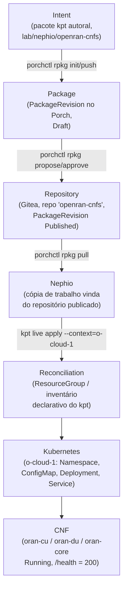

# Fluxo de provisionamento das CNFs via Nephio (Fase 12)

> Este documento mostra como uma Network Function **chega** ao workload cluster usando os
> mecanismos reais do Nephio (kpt + Porch + repositório de pacotes + reconciliação
> declarativa) — não apenas `kubectl apply`. O baseline "sem Nephio" (Passo 7) está em
> [`lab/kubernetes/README.md`](../lab/kubernetes/README.md); este documento é o próximo passo.

## 1. Cadeia demonstrada



Todos os passos abaixo foram **executados de verdade** neste laboratório (não é um roteiro
teórico) — evidência em `evidence/` e reprodutível via
[`lab/nephio/deploy-cnfs-via-porch.sh`](../lab/nephio/deploy-cnfs-via-porch.sh).

## 2. Passo a passo (com o que aconteceu de verdade)

### 2.1 Intent / Package

O pacote kpt foi **autorado do zero** (não clonado de um catálogo upstream) em
[`lab/nephio/openran-cnfs/`](../lab/nephio/openran-cnfs/): um `Kptfile` + os manifests das 3
CNFs (`namespace.yaml`, `<nf>-configmap.yaml`, `<nf>-deployment.yaml`, `<nf>-service.yaml`,
reaproveitados de `lab/kubernetes/`).

### 2.2 Repositório

Um novo repositório de **deployment** foi registrado no Porch, reaproveitando o mesmo padrão
já usado para os repositórios `mgmt`/`mgmt-staging` (pacote kpt
`distros/sandbox/repository@v6`, que cria o repo no Gitea + os objetos
`infra.nephio.org/Repository` e `Token` + o `config.porch.kpt.dev/Repository`):

```bash
bash scripts/06-porch-repos.sh openran
```

Resultado real:
```
NAMESPACE   NAME            TYPE   CONTENT   DEPLOYMENT   READY   ADDRESS
default     openran-cnfs    git    Package   true         True    http://172.18.0.200:3000/nephio/openran-cnfs.git
```

### 2.3 Package Revision (Draft → Proposed → Published)

Ferramenta: **`porchctl`** (CLI oficial do Porch, instalada na versão **v1.5.6** — a mesma do
servidor Porch do Nephio R6 rodando no cluster). Comandos reais:

```bash
porchctl rpkg init openran-nfs --repository=openran-cnfs --workspace=v1 -n default
porchctl rpkg pull openran-cnfs.openran-nfs.v1 /tmp/openran-nfs-work -n default   # baixa a cópia de trabalho
cp lab/nephio/openran-cnfs/*.yaml /tmp/openran-nfs-work/                          # mescla o conteúdo real
porchctl rpkg push  openran-cnfs.openran-nfs.v1 /tmp/openran-nfs-work -n default
porchctl rpkg propose openran-cnfs.openran-nfs.v1 -n default
porchctl rpkg approve openran-cnfs.openran-nfs.v1 -n default
```

**Armadilha real encontrada e documentada:** um `porchctl rpkg push` direto sobre o diretório
recém-criado por `init` falha com `Error: ".KptRevisionMetadata" not found`. A causa: o `push`
espera metadados internos que só existem numa cópia baixada via `porchctl rpkg pull` — ou seja,
o fluxo correto é **pull antes de editar**, não `init` seguido de `push` direto. Corrigido
como mostrado acima. Confirmação de que o conteúdo real chegou ao Porch (não ficou vazio):

```
$ kubectl get packagerevisionresources... | grep -o '"[a-zA-Z0-9_.-]*\.yaml"'
"namespace.yaml" "oran-core-configmap.yaml" "oran-core-deployment.yaml" "oran-core-service.yaml"
"oran-cu-configmap.yaml"  "oran-cu-deployment.yaml"  "oran-cu-service.yaml"
"oran-du-configmap.yaml"  "oran-du-deployment.yaml"  "oran-du-service.yaml"
```

```
NAME                             PACKAGE       WORKSPACENAME  REVISION  LATEST  LIFECYCLE   REPOSITORY
openran-cnfs.openran-nfs.v1      openran-nfs   v1             1         true    Published   openran-cnfs
```

### 2.4 Reconciliação → Kubernetes → CNF

O conteúdo **Published** foi puxado de volta (fonte = o repositório, não o disco local) e
aplicado ao `o-cloud-1` via `kpt live apply`, que cria um `ResourceGroup` — um inventário
declarativo que rastreia exatamente quais recursos pertencem a este pacote (permitindo
`kpt live apply`/`destroy` idempotentes, igual ao mecanismo usado internamente pelo próprio
Config Sync):

```bash
porchctl rpkg pull openran-cnfs.openran-nfs.v1 /tmp/openran-cnfs-delivery -n default
cd /tmp/openran-cnfs-delivery
kpt live init . --namespace=default
kpt live apply . --reconcile-timeout=2m --context=o-cloud-1
```

Resultado real:
```
apply result: 10 attempted, 10 successful, 0 skipped, 0 failed
reconcile result: 10 attempted, 10 successful, 0 skipped, 0 failed, 0 timed out

deployment.apps/oran-core   1/1   Running
deployment.apps/oran-cu     1/1   Running
deployment.apps/oran-du     1/1   Running
```

`/health` das 3 NFs, executado de dentro do cluster (`kubectl exec`), retornou `200`.

**Armadilha real #2:** a primeira tentativa de `kpt live apply` **pulou tudo**
(`apply skipped: inventory policy prevented actuation (strategy: Apply, status: Empty, policy:
MustMatch)`), porque o `Namespace openran-lab` já existia no cluster (criado manualmente no
Passo 7, via `kubectl apply` puro) e não tinha a anotação de inventário deste `ResourceGroup` —
o kpt, por padrão, **recusa adotar silenciosamente** um recurso que já existe e não é seu, para
evitar conflitos de propriedade. Resolvido removendo o namespace antigo (criado fora do fluxo
Nephio) antes de deixar o kpt criá-lo e passar a ser o dono. Isso ilustra, na prática, a
diferença entre "gerenciado pelo Nephio" e "aplicado manualmente".

## 3. O que é genuíno neste fluxo × o que foi simplificado

| Elemento | Situação |
|---|---|
| Pacote autorado (kpt, `Kptfile`) | ✅ real |
| `PackageRevision` no Porch, ciclo Draft→Proposed→Published | ✅ real, via `porchctl` |
| Repositório Git dedicado (Gitea), registrado no Porch | ✅ real |
| Conteúdo aplicado vindo do repositório publicado (não do disco) | ✅ real (`porchctl rpkg pull`) |
| Reconciliação declarativa com inventário (`ResourceGroup`) | ✅ real (`kpt live apply`) |
| **Reconciliação contínua/automática (watch-loop) no `o-cloud-1`** | ⚠️ **simplificado** — ver §4 |

## 4. Limitação assumida: sem Config Sync rodando no `o-cloud-1`

O padrão "canônico" do Nephio para GitOps multi-cluster instala o **Config Sync** (com um
`RootSync`) em **cada** workload cluster, para que ele fique observando continuamente o
repositório de deployment e aplique mudanças automaticamente, sem intervenção manual — é
exatamente o que acontece com o **management cluster** neste mesmo laboratório
(`RootSync mgmt`, documentado em `docs/05-experiment-report.md` §6).

**Decisão consciente:** não instalamos um segundo stack completo de Config Sync (+ cert-manager,
+ reconciler-manager, + resource-group-controller) no `o-cloud-1` só para as 3 CNFs simuladas.
Isso demandaria repetir, num segundo cluster, a mesma sequência de correções de bugs de upstream
já documentada em `docs/02-nephio-installation.md`, por um ganho pedagógico marginal — já
demonstramos, de forma completa e evidenciada, um watch-loop de Config Sync real no fluxo de
provisionamento do próprio O-Cloud (`docs/05` §6).

Em vez disso, a entrega usa **`kpt live apply`** — o mesmo mecanismo de reconciliação
declarativa (inventário, detecção de drift, apply idempotente) que o Config Sync usa por baixo
dos panos, só que disparado **sob demanda** em vez de continuamente. A diferença prática:
mudar o pacote no Porch exige rodar `deploy-cnfs-via-porch.sh` de novo (não é observado e
aplicado automaticamente). O restante da cadeia — package, repository, revisão, publicação — é
idêntico ao fluxo de produção do Nephio.

## 5. Reprodução

```bash
bash scripts/06-porch-repos.sh openran        # 1x, idempotente
bash lab/nephio/deploy-cnfs-via-porch.sh       # publica/atualiza + entrega no o-cloud-1
```
