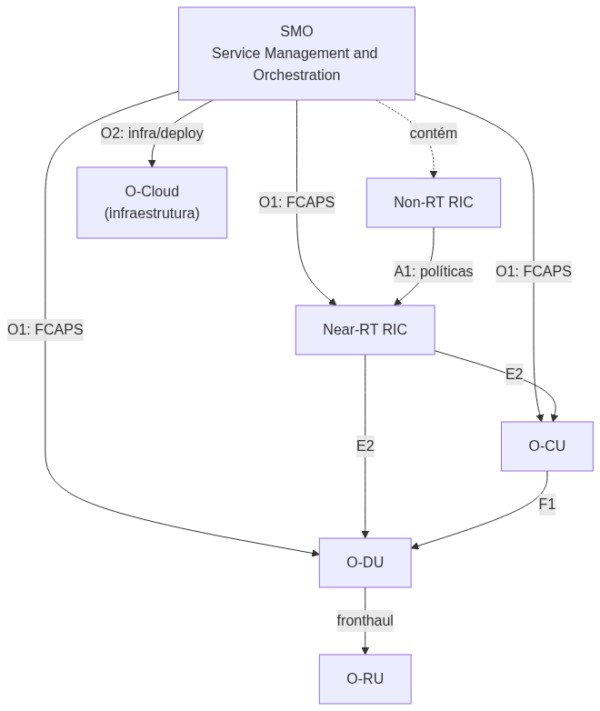
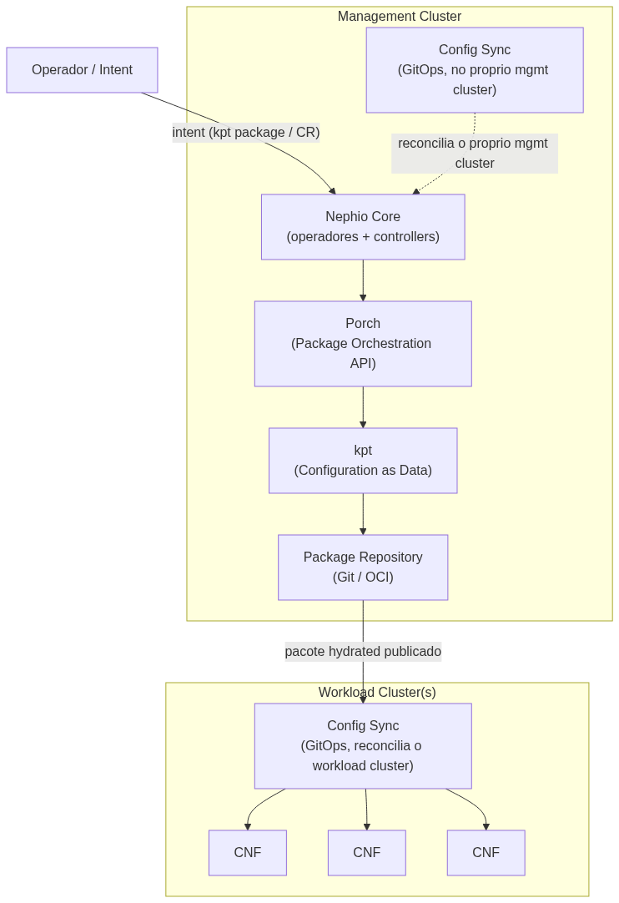
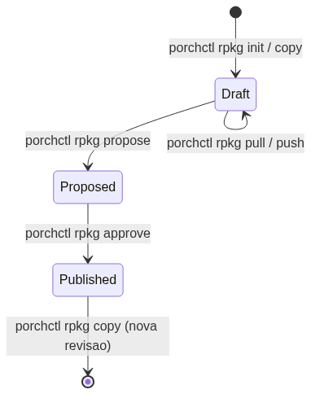
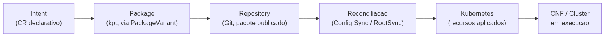
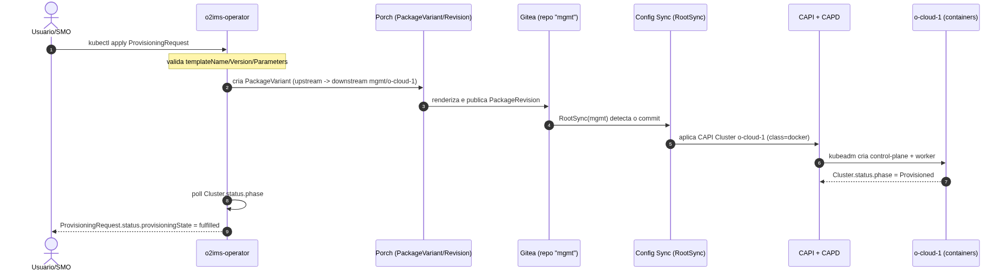

## Plataformas de SMO para Open RAN: o caso Nephio

- Disciplina: redes Open RAN — Parte 1 (30%)
- Ferramenta analisada: **Nephio** (Linux Foundation Networking)
- Foco: arquitetura, funções de SMO, interfaces O1/O2, O-Cloud, NF lifecycle
- Autor: Diego Abreu — Curso CESAR — 2026-09-11

::: notes
Bom dia/tarde. Meu trabalho analisa o Nephio como plataforma de automação para Open RAN. Já
adianto a tese central: vou mostrar o que o Nephio realmente faz — com evidência prática — e
onde ele não cobre o escopo completo do SMO definido pela O-RAN Alliance.
:::

## Open RAN e o papel do SMO

- Open RAN desagrega o RAN: O-RU, O-DU, O-CU (CP/UP), conectados por interfaces abertas
- Introduz dois controladores de inteligência: Near-RT RIC e Non-RT RIC
- **SMO** = framework de gerência de topo da arquitetura O-RAN
- Termina as interfaces **O1**, **O2** e **A1** (via Non-RT RIC)



::: notes
O Open RAN só funciona na prática se existir uma camada central de gerência. É isso que o SMO
faz: ele fala com os elementos de rede via O1, com a infraestrutura de nuvem via O2, e distribui
políticas para o Near-RT RIC via A1.
:::

## Por que o SMO é necessário

- Multi-fornecedor só funciona com orquestração central e interfaces padronizadas
- Sem SMO: integração manual, sem escala, sem automação de ciclo de vida
- Responsabilidades: FCAPS, gerenciamento de O-Cloud, inventário, políticas, orquestração
  ponta a ponta
- É uma **arquitetura de responsabilidades**, não um produto único

::: notes
Sem essa camada, a promessa de "abertura" do Open RAN não se sustenta operacionalmente — seria
preciso integrar manualmente dezenas de componentes de fornecedores diferentes.
:::

## O que é Nephio

- Projeto **graduado da Linux Foundation Networking** (2022, LF + Google Cloud)
- *"Carrier-grade, simple, open, Kubernetes-based cloud native intent automation"*
- Núcleo **agnóstico de telecom**: Kubernetes + Configuration as Data (kpt) + GitOps
- Conecta-se ao O-RAN via operadores específicos (O2 IMS, FOCOM) — não é o SMO em si

> "Nephio is a cloud-native automation and orchestration platform that can implement or
> support functions associated with the SMO and O-Cloud management architecture."

::: notes
Esta frase é a tese do meu trabalho. Nephio pode implementar ou apoiar funções do SMO — não é,
ele próprio, o SMO oficial da especificação O-RAN.
:::

## Arquitetura

- **Management Cluster**: Nephio Core, Porch, repositório de pacotes, Config Sync
- **Workload Cluster(s)**: onde as CNFs rodam, reconciliadas via GitOps
- Porch = *"kpt-as-a-service"* — API Kubernetes para gerenciar pacotes
- kpt = toolchain *"package-centric"* sobre *Configuration as Data*



::: notes
Dois tipos de cluster: um de gestão, que decide o quê e como configurar, e um ou mais de carga,
onde as funções de rede realmente rodam.
:::

## Componentes

- `Repository` — repositório Git/OCI registrado no Porch (read-only ou deployment)
- `PackageRevision` — uma revisão de pacote (Draft → Proposed → Published)
- `PackageVariant` / `PackageVariantSet` — gera variações de um pacote para um ou mais destinos
- Controllers Kubernetes reconciliam cada uma dessas CRDs continuamente



::: notes
Esses não são conceitos abstratos — são CRDs reais que instalei e observei rodando no meu
cluster de laboratório.
:::

## GitOps e automação orientada a intenção

- **GitOps**: o Git é a fonte de verdade; um agente reconcilia o cluster a partir dele
- Config Sync = a ferramenta GitOps usada pelo Nephio
- Mesmo padrão do *control loop* oficial do Kubernetes: *"move o estado atual em direção ao
  estado desejado"*
- **Intent** = uma declaração de alto nível (CR) que a cadeia de controllers traduz em recursos
  concretos



::: notes
O operador nunca escreve manifesto de baixo nível — declara a intenção, e a cadeia de
controllers cuida do resto.
:::

## Provisionamento

- Fluxo: `ProvisioningRequest` (intent) → `PackageVariant` (Porch) → `PackageRevision`
  (publicada no Git) → reconciliação (Config Sync) → `Cluster` real
- Dois níveis de orquestração: de **pacotes** (Porch) e de **infraestrutura** (Cluster API)
- **Demonstrado no laboratório**: um único objeto declarativo gerou um cluster Kubernetes real
  de 2 nós



::: notes
Isso não é teoria — apliquei um ProvisioningRequest e, minutos depois, tinha um segundo cluster
Kubernetes rodando, criado inteiramente por essa cadeia.
:::

## Interface O1

- O1 = gerência **FCAPS** entre SMO e elementos RAN (O-CU, O-DU, Near-RT RIC)
- Configuração via NETCONF/YANG; notificações via REST/VES
- **Nephio não implementa O1** — confirmado por descoberta completa do cluster (76 CRDs, nenhuma
  relacionada a O1)
- Essa função pertence, no ecossistema O-RAN, ao projeto O-RAN-SC OAM

> **Resultado da descoberta no cluster real:** 76 CRDs instaladas, 0 relacionadas a O1/NETCONF/YANG.

::: notes
Sou direto aqui: não encontrei, no cluster real, nenhum componente de O1. É uma lacuna real,
não um detalhe.
:::

## Interface O2

- O2 = interface SMO ↔ O-Cloud; dividida em **O2 IMS** (infraestrutura) e **O2 DMS** (deployment)
- Nephio R6 implementa uma **PoC funcional de O2 IMS**: CRD `ProvisioningRequest`
  (`o2ims.provisioning.oran.org`)
- Fluxo **executado e validado**: `provisioningState: fulfilled`
- O próprio pacote se declara *"work-in-progress in O-RAN standards... a PoC"*

```
"provisioningStatus": {
  "provisioningMessage": "Cluster resource created",
  "provisioningState": "fulfilled",
  "provisioningUpdateTime": "2026-09-10T16:22:18Z"
}
```
*(evidence/o2ims/20260910-132543_etapa7_watch.txt — status real do cluster o-cloud-1)*

::: notes
Aqui o Nephio entrega de verdade — vou mostrar na Parte 2 o status: fulfilled saindo do cluster
real, não de um slide.
:::

## O-Cloud

- O-Cloud = plataforma de nuvem (NFVI + VIM + aceleradores) que hospeda as NFs O-RAN
- Nephio provisiona **O-Cloud Node Cluster** via O2 IMS + Cluster API — capacidade parcial,
  reconhecida pela própria documentação oficial
- Sem inventário de hardware/aceleradores, sem NFVI/VIM completos
- No laboratório: um cluster kind representa academicamente o O-Cloud

| | O-Cloud real (spec O-RAN) | Neste laboratório |
|---|---|---|
| Hardware/aceleradores | Inventariado via O2 IMS | Não aplicável (kind/Docker) |
| NFVI/VIM | Completo | Ausente |
| Cluster Kubernetes | Um dos artefatos provisionados | `o-cloud-1` (kind, 2 nós) — provisionado pelo mecanismo correto |

::: notes
É importante ser honesto: o que chamo de O-Cloud aqui é um cluster Kubernetes local, sem
hardware nem rede de transporte reais — mas provisionado pelo mecanismo certo.
:::

## Ciclo de vida de Network Functions

- Demonstrado: **instantiate → scale → update → recover → terminate**
- Mecanismo: Deployment/ReplicaSet do Kubernetes, não um ciclo de vida *NF-aware* O-RAN
- Sem KPIs de rede, sem re-registro em interfaces O-RAN, sem healing orientado a causa-raiz
- Base para os experimentos práticos da Parte 2

::: notes
O que demonstro é lifecycle de Kubernetes. Não confundo isso com lifecycle de uma NF de telecom
real — a diferença é central para o meu trabalho.
:::

## Monitoramento e falhas

- Nephio **não inclui** stack de monitoramento/telemetria nativo
- Sem coleta de KPI O1/PM, sem VES
- Fault management observável = *self-healing* padrão do Kubernetes (não FCAPS-F O-RAN)
- No laboratório: `kubectl`/`docker stats`/logs — opção leve, compatível com 16 GB de RAM

::: notes
Decidi não instalar Prometheus/Grafana para manter o laboratório leve — e isso também ilustra
bem os limites reais do que o Nephio entrega de fábrica.
:::

## Comparação com outras soluções

| | ONAP | ETSI OSM | O-RAN-SC SMO | Tacker | **Nephio** |
|---|---|---|---|---|---|
| **O1** | Não nativo | Não nativo | Sim | Não | **Não** |
| **O2** | Não | Não | Sim | Não | **Sim (PoC)** |
| **Lab local 16 GB** | 🔴 >32 GB | 🟡 moderado | 🔴 difícil | 🔴 inviável | 🟢 **~3,6 GiB medidos** |

::: notes
A escolha do Nephio não foi só teórica — foi a única viável dentro da restrição real de
hardware que eu tinha disponível.
:::

## Conclusão

- Nephio é uma **plataforma de automação cloud-native efetiva**, com evidência real de
  provisioning (O2 IMS) e lifecycle Kubernetes
- **Não é** uma implementação completa/certificada do SMO — faltam O1, Non-RT RIC, telemetria,
  política A1
- Essa caracterização precisa é a base da Parte 2: provisionamento e gerenciamento prático de
  uma pilha Open RAN simulada
- Próximo passo: demonstração ao vivo (Parte 2)

> "Nephio is a cloud-native automation and orchestration platform that can implement or
> support functions associated with the SMO and O-Cloud management architecture."

::: notes
Fico com uma conclusão equilibrada: o Nephio entrega automação real e demonstrável para uma
fatia bem definida do escopo do SMO — e eu mostrei, com evidência, exatamente onde essa fatia
termina. Obrigado — perguntas?
:::
