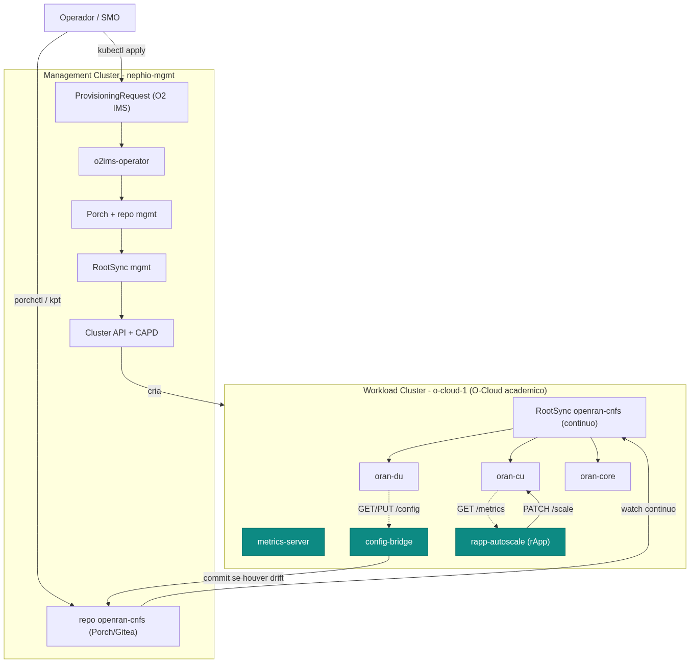
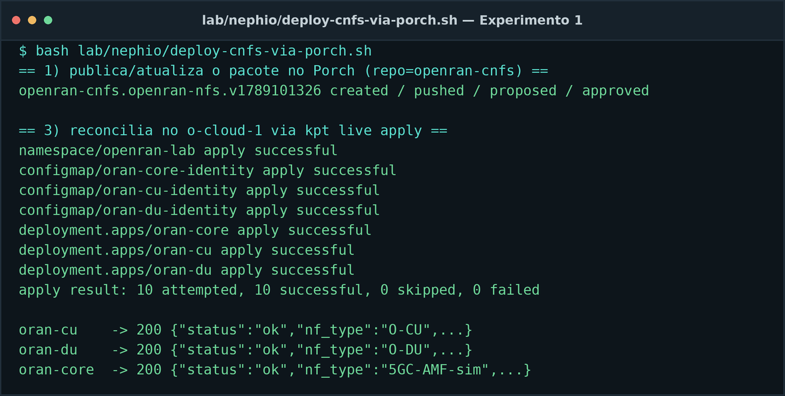
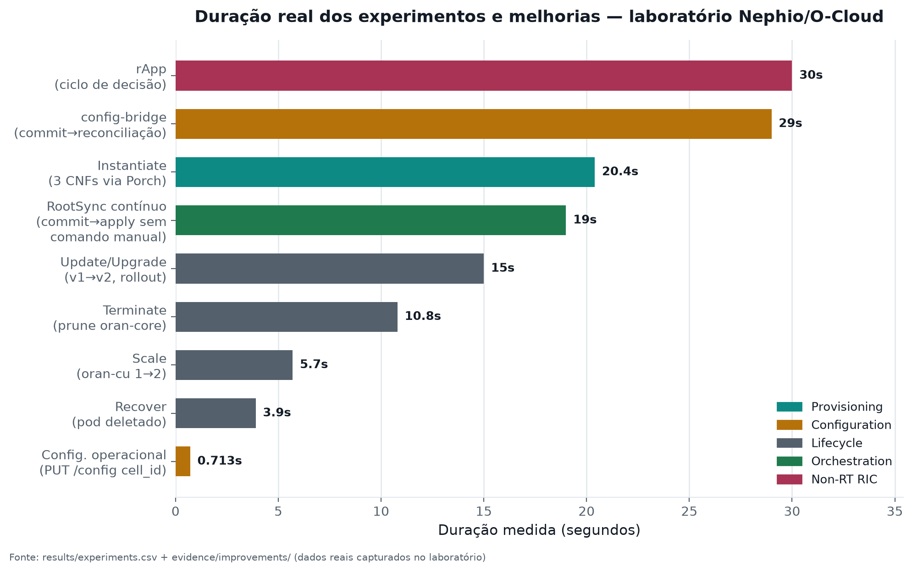
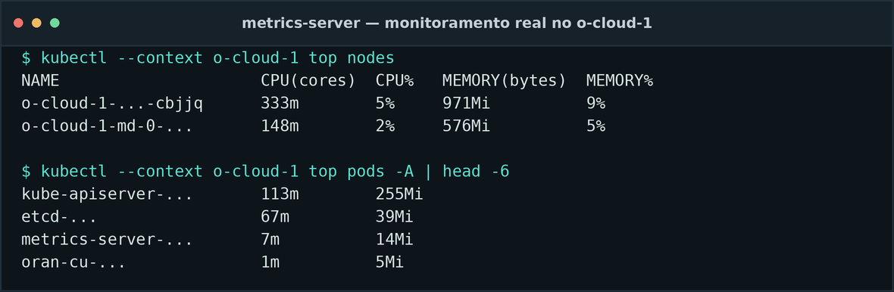
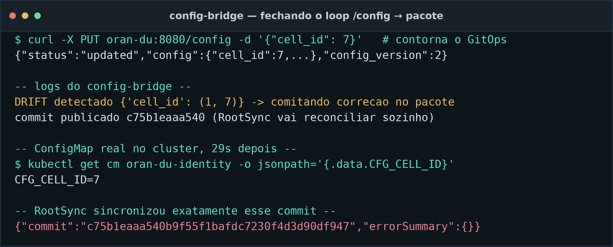
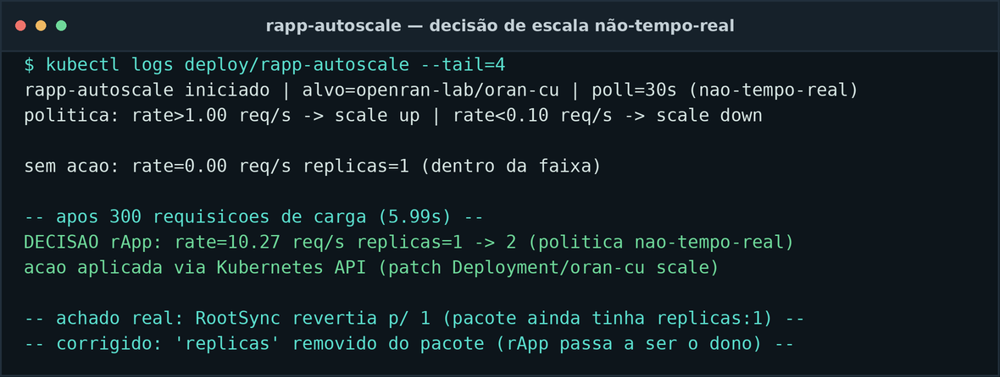
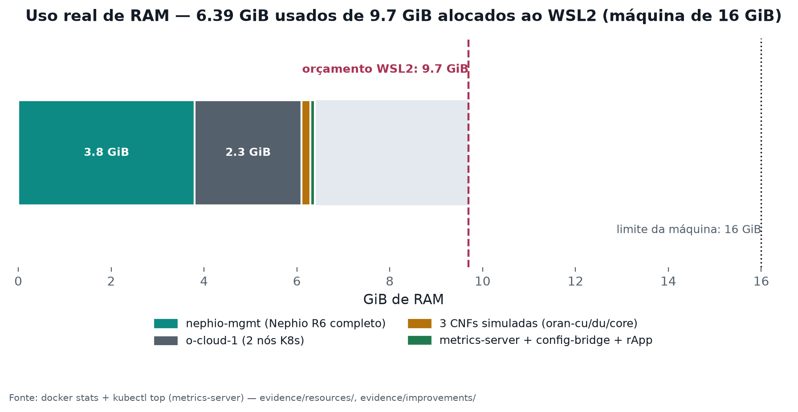

## Provisionamento e gerenciamento prático de uma pilha Open RAN com Nephio

- Parte 2 (70%) — disciplina de redes Open RAN, Curso CESAR
- Usar o Nephio, na prática, para provisionar e gerenciar uma pilha Open RAN **simulada**
- 3 Network Functions representativas: `oran-cu`, `oran-du`, `oran-core`
- Autor: Diego Abreu — atualizado em 2026-09-25 com 4 melhorias pós-entrega

::: notes
Na Parte 1 caracterizei o que o Nephio faz e não faz. Agora vou provar isso na prática, com
números reais de um laboratório que rodou nesta máquina — incluindo quatro melhorias que
implementei depois da entrega original, a pedido do avaliador.
:::

## Arquitetura final

::: notes
Dois clusters, dois papéis. O de baixo — o O-Cloud — foi criado pelo próprio Nephio via O2 IMS.
As três peças em destaque — metrics-server, config-bridge e rapp-autoscale — são as melhorias
que vou detalhar na segunda metade da apresentação.
:::

## Ambiente

- Windows 11 + WSL2 Ubuntu, Docker Engine nativo, 16 GB de RAM totais
- Nephio R6 (`v6.0.0`), Porch v1.5.6, kpt v1.0.0
- `.wslconfig`: teto de 9,7 GB para todo o laboratório
- 100% local — sem cloud paga, sem OpenStack

::: notes
Nada disso rodou em nuvem. É o notebook, com WSL2, dentro de um orçamento de RAM apertado —
volto a esse orçamento no fim, porque as 4 melhorias novas também tiveram que caber nele.
:::

## As Network Functions

- `oran-cu`, `oran-du`, `oran-core` — FastAPI, ~30–50 MiB de RAM cada
- `/health`, `/config` (GET/PUT), `/metrics` (Prometheus)
- **Workloads representativos — não NFs O-RAN reais** (sem F1/E1/E2, sem plano de usuário)
- Avaliei substituir por free5GC/UERANSIM/OAI — não coube no orçamento (docs/real-nf-extension.md)

::: notes
Deixo bem claro: isso é um simulador leve para exercitar mecanismos, não uma pilha 5G real. Já
avaliei o caminho para NFs reais e documentei por que não coube aqui.
:::

## Provisionamento (Experimento 1)

- Pacote kpt autoral → Porch (`porchctl rpkg init/push/propose/approve`)
- `PackageRevision` Published no repositório `openran-cnfs`
- `kpt live apply` no `o-cloud-1` — reconciliação declarativa com `ResourceGroup`
- **20,4 s do zero até 3/3 NFs Running**

::: notes
Esse não é um kubectl apply. É um pacote publicado, versionado, com histórico — o mesmo
mecanismo que o Nephio usa para qualquer coisa em produção.
:::

## Config update (Experimento 2)

- `oran-du`: `cell_id` `1 → 2` via `PUT /config` — **0,7 s**
- Camada operacional da NF (análoga a O1/NETCONF numa NF real) — API REST própria, não O1
- Distinto da config de **implantação** (pacote/Porch) — usada no upgrade

::: notes
Duas camadas de configuração, de propósito diferente — mostro as duas ao longo da apresentação
sem misturar uma com a outra.
:::

## Scaling e Upgrade (achado real incluso)

- Scale: `oran-cu` 1 → 2 réplicas — **5,7 s**
- Upgrade: `NF_VERSION` v1 → v2 via pacote no Porch — **15,0 s**, `revision` 1 → 2
- **Achado real:** só mudar o `ConfigMap` não disparou rollout — corrigido com anotação de versão

::: notes
Esse foi um dos experimentos mais instrutivos: bati de frente com um comportamento real do
Kubernetes, descobri a causa e corrigi.
:::

## Fault / recovery e Terminate

- Recovery: `kubectl delete pod` → novo pod em **3,9 s** (self-healing, não healing de NF telecom)
- Terminate: `oran-core` removido via **prune** do `kpt live apply` — **10,8 s**
- 6/6 experimentos formais: `success`

::: notes
Da instanciação até a remoção — cada etapa, medida e registrada, não só narrada. E já adianto
aqui as três melhorias que vou detalhar a seguir, no mesmo gráfico.
:::

## Resultados e limites originais

- ~3,9 GiB de RAM (Nephio + O-Cloud + CNFs), bem dentro do teto de 9,7 GiB
- 2 bugs de engenharia reais encontrados **e corrigidos** na entrega original
- Limitações levantadas: sem GitOps contínuo, sem monitoramento por métrica, sem propagação `/config` → pacote

::: notes
Prefiro mostrar os bugs reais que encontrei a esconder que existiram. E são exatamente essas
três limitações que ataquei nas melhorias pós-entrega, a seguir.
:::

## Melhoria 1 — metrics-server

- Instalado no `o-cloud-1`: manifesto oficial + `--kubelet-insecure-tls`
- Fecha "Monitoring: não incluído nativamente" da tabela SMO×Nephio
- Custo: ~15 MiB de RAM

::: notes
Antes só tínhamos docker stats. Agora tenho kubectl top de verdade — métrica real por nó e por
pod, sem instalar Prometheus completo.
:::

## Melhoria 2 — RootSync contínuo

- Config Sync no próprio `o-cloud-1`, apontando para o repo `openran-cnfs`
- Fecha "sem GitOps contínuo" — não depende mais de rodar o script manualmente
- **Prova real:** publiquei v3 no Porch sem tocar no cluster — aplicado sozinho em **19 s**

::: notes
Isso é GitOps de verdade fechando o gap — não só o RootSync instalado, mas provado que ele
reage sozinho a um commit, sem eu chamar kpt live apply.
:::

## Melhoria 3 — config-bridge

- Fecha o loop `/config` (NF) → pacote: detecta drift e comita a correção
- RootSync (melhoria 2) reconcilia o resto sozinho

::: notes
Achei e corrigi um bug real nessa: o YAML sem aspas fazia "00101" virar o inteiro 101 na
releitura — um padrão octal-like do YAML 1.1 — causando um loop de auto-correção a cada 15s.
Corrigi forçando aspas em todo escalar.
:::

## Melhoria 4 — rapp-autoscale (Non-RT RIC)

- Decisão registrada: **rApp sim, xApp não** — rApp roda no Non-RT RIC, parte do próprio SMO;
  xApp exigiria E2/Near-RT RIC reais, que este laboratório não implementa
- Poll de 30s (não-tempo-real, por definição O-RAN) sobre `/metrics` → decide escala via `/scale`

::: notes
Aqui apareceu o achado mais interessante de todos: o RootSync revertia a decisão do rApp de
volta pra 1 réplica, porque o pacote ainda declarava replicas:1 no Git — um conflito real de
autoridade entre GitOps declarativo e controle imperativo, o mesmo problema que existe quando
um HPA coexiste com GitOps na vida real. Corrigi removendo "replicas" do pacote.
:::

## Status honesto e uso de RAM

- Reverificação final do rApp **pendente** — ambiente sofreu suspensões repetidas do host
  durante os testes finais desta sessão, não um problema de lógica
- Nenhuma evidência foi forjada para cobrir essa lacuna — documentado com todas as letras

::: notes
Prefiro terminar mostrando exatamente onde parei, sem fingir que terminei algo que não terminei
— isso é mais valioso academicamente do que uma apresentação sem nenhuma pendência.
:::

## Conclusão

- Nephio orquestrou o ciclo de vida completo de CNFs com seus mecanismos nativos — não `kubectl apply`
- 4 melhorias pós-entrega fecharam Monitoring, GitOps contínuo, e parte de Non-RT RIC/rApp
- **11 bugs de engenharia reais** encontrados e corrigidos ao longo de toda a Parte 2
- O que é abstração: as NFs, o O-Cloud, a federação FOCOM, o xApp (deliberadamente não simulado)
- O que é real: Porch/kpt/RootSync, provisionamento O2 IMS, e agora monitoramento + um rApp funcional

::: notes
Entre teoria (Parte 1) e prática (Parte 2), a mesma conclusão se sustenta: o Nephio é uma
plataforma de automação cloud-native real, que implementa um subconjunto bem definido — e
demonstrado, com evidência, inclusive nas melhorias — das funções associadas ao SMO. Obrigado.
:::
