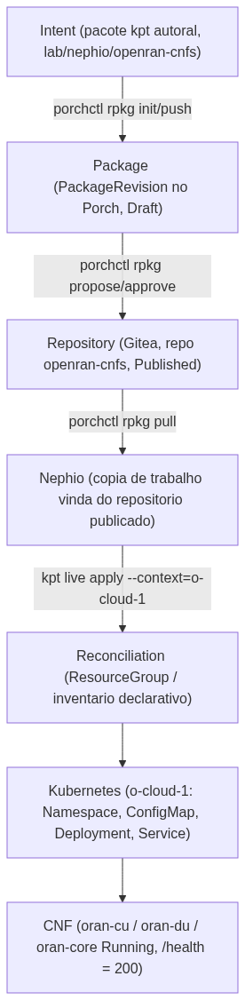
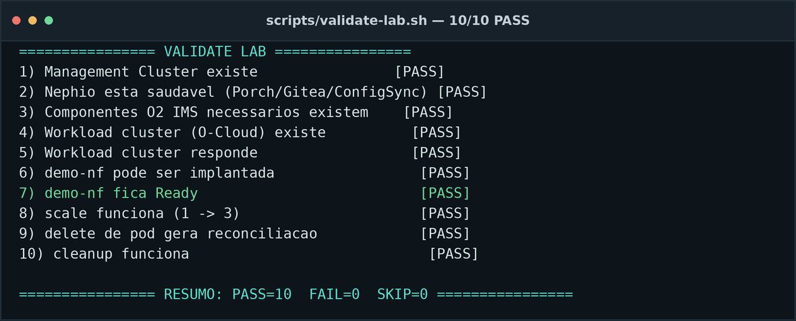

## Provisionamento e gerenciamento prático de uma pilha Open RAN com Nephio

- Parte 2 (70%) — disciplina de redes Open RAN, Curso CESAR
- Usar o Nephio, na prática, para provisionar e gerenciar uma pilha Open RAN **simulada**
- 3 Network Functions representativas: `oran-cu`, `oran-du`, `oran-core`, sobre um O-Cloud
  provisionado pelo próprio Nephio (Parte 1)
- Autor: Diego Abreu — versão detalhada, atualizada em 2026-09-25 com 4 melhorias pós-entrega

::: notes
Na Parte 1 caracterizei teoricamente o que o Nephio faz e não faz frente à especificação de SMO
da O-RAN Alliance. Esta Parte 2 existe para provar isso na prática — cada afirmação que vou
fazer aqui tem um comando, uma saída real e um arquivo de evidência por trás, não é só slide.
:::

## Objetivo desta Parte 2

- Demonstrar, com **evidência mensurável** (tempo, RAM, CPU), os quatro mecanismos centrais de
  SMO/orquestração: **provisioning, configuration management, orchestration, lifecycle
  management**
- Não é um roteiro "follow-along" — é um experimento real, com bugs reais encontrados e
  corrigidos ao vivo, documentados em vez de escondidos
- Critério de sucesso: cada operação tem que sair de um comando real, não de uma afirmação
- Distinguir o tempo todo **4 "ciclos de vida" diferentes**: Kubernetes, Nephio/orquestração,
  O2 IMS, e NF O-RAN real (este último — nunca demonstrado, e digo isso com todas as letras)

::: notes
Essa distinção dos quatro ciclos de vida é o fio condutor de todo o trabalho. Vou repetir isso
várias vezes ao longo da apresentação porque é fácil confundir "o Kubernetes reconciliou o pod"
com "a NF se curou" — são coisas completamente diferentes, e misturar as duas é exatamente o
tipo de exagero que este trabalho existe para evitar.
:::

## Recapitulando a tese da Parte 1

> "Nephio is a cloud-native automation and orchestration platform that can implement or support
> functions associated with the SMO and O-Cloud management architecture."

- Nephio **não é** o SMO oficial da especificação O-RAN — é uma plataforma de automação
  cloud-native que implementa **partes** das funções do SMO
- Forte em: provisioning de infraestrutura (O2 IMS), lifecycle de deployment Kubernetes
- Fraco/ausente em: O1 (FCAPS via NETCONF/YANG), Non-RT RIC/A1, telemetria O-RAN nativa
- Esta Parte 2 usa exatamente essa caracterização como roteiro dos experimentos

::: notes
Repito essa frase porque é a âncora de tudo. Cada experimento que vou mostrar valida ou
contesta uma linha específica dessa tabela função-por-função da Parte 1 — não escolhi os
experimentos ao acaso.
:::

## Ambiente e por que essas escolhas

- Windows 11 + WSL2 Ubuntu, Docker Engine **nativo** no WSL2 (não Docker Desktop) — menor overhead
- Nephio R6 (`v6.0.0`), instalado pacote-a-pacote via `kpt` — não o instalador Ansible do sandbox
  (que traz Argo CD + Flux + WebUI completos, inviável em 16 GB)
- `.wslconfig`: teto de **9,7 GB** para todo o laboratório, dentro de uma máquina de 16 GB
- 100% local — sem cloud paga, sem OpenStack, sem cluster K8s externo
- kind (Kubernetes-in-Docker) para os dois clusters — leve, sem VM pesada

::: notes
Cada uma dessas escolhas foi uma decisão de orçamento de RAM. O instalador oficial do Nephio
sozinho já estouraria os 16 GB se eu tivesse usado a distribuição completa — por isso instalei
pacote a pacote, só o mínimo necessário para provar o mecanismo.
:::

## Arquitetura — conceito geral

- **Management Cluster** (`nephio-mgmt`): Nephio Core, Porch, repositório de pacotes, Config Sync
- **Workload Cluster** (`o-cloud-1`): onde as CNFs realmente rodam
- `o-cloud-1` foi **provisionado pelo próprio Nephio** via O2 IMS — não um `kind create` manual
  (resultado da Parte 1, reaproveitado aqui como base)

::: notes
Esse diagrama é conceitual — o real, com todos os componentes desta Parte 2, vem no próximo
slide. Mas a ideia central já está aqui: dois clusters, papéis bem separados.
:::

## Arquitetura final (com as 4 melhorias)

- Camada 1 (infraestrutura): `ProvisioningRequest` → `o2ims-operator` → Cluster API/CAPD → `o-cloud-1`
- Camada 2 (NFs): pacote kpt → Porch → `RootSync` contínuo → `oran-cu/du/core`
- Três peças em destaque (teal) são as melhorias pós-entrega — detalhadas na segunda metade

::: notes
As três peças em destaque — metrics-server, config-bridge e rapp-autoscale — não faziam parte
da entrega original. Vou chegar nelas, mas primeiro mostro tudo que foi entregue no prazo
original, com os 6 experimentos formais.
:::

## Ferramentas e o papel de cada uma

- **kpt** — autoria do pacote, pipeline de funções, `kpt live apply` (reconciliação declarativa
  com inventário `ResourceGroup`)
- **Porch / `porchctl`** — ciclo de vida do pacote: Draft → Proposed → Published
- **kind + Cluster API + CAPD** — criação do `o-cloud-1` via O2 IMS
- **kubectl** — operações imperativas de comparação (scale, delete pod) e validação
- **FastAPI/Python + Docker** — as 3 CNFs simuladas

::: notes
Nenhuma dessas ferramentas é exclusiva de telecom — é exatamente esse o ponto da Parte 1: o
núcleo do Nephio é agnóstico, e se conecta ao mundo O-RAN só através de operadores específicos.
:::

## As Network Functions simuladas

- `oran-cu`, `oran-du`, `oran-core` — serviços FastAPI, ~30–50 MiB de RAM cada
- Cada uma expõe `/health`, `/config` (GET/PUT/POST), `/metrics` (formato Prometheus)
- **Workloads representativos — não NFs O-RAN reais**: sem protocolos de rádio, sem planos de
  usuário/controle, sem interfaces F1/E1/E2
- Servem para exercitar **mecanismos de orquestração**, não para simular tráfego de rede

::: notes
Sou direto aqui: se alguém perguntar "isso é um O-CU de verdade?", a resposta é não. É um
serviço HTTP com o nome de um O-CU, para eu poder demonstrar scale/update/recover/terminate
sobre algo que se parece com uma NF, sem pagar o custo de RAM de uma pilha 5G real.
:::

## Por que não usei uma NF real (avaliação feita)

- Avaliei 3 alternativas para o próximo passo: **UERANSIM**, **free5GC**, **OpenAirInterface**
- UERANSIM sozinho: ~2 GB/2 CPU — mas não funciona sem um AMF real por trás
- free5GC completo: 4 GB mínimo / 8 GB recomendado — **sozinho já consome quase todo o
  orçamento restante** (Nephio + O2 IMS + O-Cloud já usam ~3,9 GiB)
- OpenAirInterface: footprint imprevisível, maior complexidade — e o próprio enunciado pediu
  para não instalar
- **Decisão:** nenhuma NF real cabia ao lado do Nephio completo em 16 GB — documentado, não
  simplesmente omitido (`docs/real-nf-extension.md`)

::: notes
Isso não foi preguiça — foi uma decisão de engenharia documentada com números reais de
requisito de RAM de cada alternativa. Se tivesse uma segunda máquina dedicada, o caminho
sugerido seria validar primeiro o onboarding do pacote do free5GC com réplicas em zero.
:::

## Fluxo de provisionamento das NFs — conceito

- As NFs chegam ao `o-cloud-1` por um **pacote kpt publicado no Porch** — não por
  `kubectl apply` direto
- Repositório Porch dedicado: `openran-cnfs`
- Cada mudança de conteúdo = uma **nova revisão** do pacote (Porch não permite `push` sobre uma
  revisão já Published — histórico completo preservado)

::: notes
Esse não é um kubectl apply disfarçado. É um pacote versionado, com Draft, Proposed e
Published — o mesmo mecanismo que o Nephio usaria em produção para qualquer coisa.
:::

## Experimento 1 — Instantiate

- **Comando:** `bash lab/nephio/deploy-cnfs-via-porch.sh`
- **O que faz:** publica o pacote no Porch (`rpkg copy/push/propose/approve`), depois
  `kpt live apply` no `o-cloud-1`
- **Resultado:** 3/3 CNFs `Running` do zero em **20,4 s**

::: notes
Dez recursos aplicados (namespace, 3 ConfigMaps, 3 Services, 3 Deployments) — todos de uma vez,
via um único pacote reconciliado declarativamente.
:::

## Duas camadas de configuração — por que distinguir

- **Configuração operacional da NF** — análoga ao que O1/NETCONF faria numa NF real: API própria
  `/config` de cada CNF
- **Configuração de implantação** (pacote/GitOps) — mudar o `ConfigMap`/`Deployment` no pacote
  autoral e republicar via Porch
- Nephio **não implementa O1** — então a API `/config` é o substituto de laboratório para essa
  camada, não uma alegação de que isso É O1

::: notes
Misturar essas duas camadas seria o tipo de exagero que quero evitar. Uma é gerência de
elemento de rede (o que seria O1); a outra é GitOps de infraestrutura — mecanismos diferentes,
propósitos diferentes.
:::

## Experimento 2 — Configuration management

- **Comando:** `PUT /config {"cell_id": 2}` no `oran-du`
- **Resultado:** `cell_id` `1 → 2`, `config_version` `1 → 2`, em **0,7 s**
- Prova que a camada operacional da NF responde e versiona suas próprias mudanças

::: notes
Rápido e direto — mas o ponto não é a velocidade, é a distinção: essa mudança fica só na API da
NF, não propaga pro pacote sozinha (isso só foi resolvido depois, na Melhoria 3).
:::

## Experimento 3 — Scale

- **Comando:** `kubectl scale deploy/oran-cu --replicas=2`
- **Resultado:** rollout concluído, `oran-cu` 2/2 `Running`, em **5,7 s**
- Mecanismo: **ReplicaSet controller do Kubernetes** — o mesmo mecanismo genérico usado por
  qualquer aplicação, não um scaling orientado por KPI de rede O-RAN

::: notes
Aqui uso deliberadamente o kubectl imperativo, em vez do pacote, para comparar com a Melhoria 4
(rApp) mais adiante — o mesmo scale, só que decidido automaticamente por uma política.
:::

## Experimento 5 — Upgrade (achado real)

- **Comando:** atualizar `NF_VERSION` v1→v2 no pacote e republicar via Porch
- **Resultado:** `revision` do Deployment 1→2, rollout real, `/health.nf_version=v2`, em **15,0 s**
- **Achado real:** mudar **só** o `ConfigMap` (consumido via `envFrom`) **não** dispara rollout —
  o hash do pod template não muda
- **Correção:** anotação de versão em `spec.template.metadata.annotations`, que força um novo
  `ReplicaSet`

::: notes
Esse foi o experimento mais instrutivo da entrega original. Bati de frente com um comportamento
real e documentado do Kubernetes, diagnostiquei com evidência e corrigi — não escondi que
falhou na primeira tentativa.
:::

## Experimento 4 — Recover

- **Comando:** `kubectl delete pod` no `oran-du`
- **Resultado:** ReplicaSet recria em **3,9 s** — pod novo, nome diferente
- **Isto é self-healing do Kubernetes** (estado desejado × estado real) — **não** é healing de
  uma NF de telecom: sem estado de sessão, sem re-registro em interfaces O-RAN

::: notes
Deixo claro sempre: "recuperação" aqui é o controller do Kubernetes fazendo seu trabalho normal,
não uma função de FCAPS-F O-RAN. É uma distinção pequena no slide, mas grande na prática.
:::

## Experimento 6 — Terminate

- **Comando:** remover `oran-core` do pacote e republicar
- **Resultado:** `oran-core` removido via **prune** do `kpt live apply`, em **10,8 s**
- Terminação pelo **mesmo mecanismo declarativo** que criou o recurso — não um
  `kubectl delete` avulso

::: notes
Fecha o ciclo completo: instantiate, config, scale, upgrade, recover, terminate — todos pelo
fluxo real do Nephio, com evidência de cada um.
:::

## Resultados consolidados (entrega original)

- **6/6 experimentos formais: `success`** (`results/experiments.csv`)
- `scripts/validate-lab.sh`: **10/10 PASS**, reexecutando automaticamente instantiate/scale/recover/terminate

::: notes
Esse gráfico já mostra os 6 experimentos originais junto com as 3 melhorias que vou detalhar
depois — dá pra comparar a ordem de grandeza de cada operação de relance.
:::

## Uso de RAM (entrega original)

- `nephio-mgmt` (Nephio R6 completo): **~3,7–3,9 GiB**
- `o-cloud-1` (2 nós K8s): **~1,4 GiB**
- 3 CNFs simuladas (juntas): **< 200 MiB**
- **Total: ~3,9 GiB usados de 9,7 GiB configurados** — bem abaixo da meta de 10–12 GB do enunciado

::: notes
Isso prova que a restrição de RAM não foi um problema teórico — o laboratório inteiro (Nephio +
O-Cloud + 3 CNFs + Porch + Gitea + Cluster API) coube com folga real, medida.
:::

## O que ficou de fora na entrega original

- **Sem GitOps contínuo no `o-cloud-1`** — entrega via `kpt live apply` sob demanda, não um
  `RootSync` observando o repositório continuamente
- **Sem monitoramento por métrica** — só `docker stats`/eventos, sem `metrics-server`
- **`cell_id` não propagava de volta ao pacote** — mudança via `/config` e via pacote eram
  caminhos independentes
- **Sem O1, sem NF real, sem Non-RT RIC/rApp, sem xApp/E2** — fronteiras já mapeadas na Parte 1

::: notes
Essas quatro primeiras lacunas eram decisões de escopo, não impossibilidades técnicas — e são
exatamente as que ataquei nas melhorias pós-entrega, a seguir.
:::

## Por que as melhorias pós-entrega

- Depois da entrega, revisei com o avaliador: "a parte de SMO foi bem implementada? O1/O2/A1
  fazem sentido? Vale simular um xApp ou rApp?"
- Decisão registrada: **rApp faz sentido** (roda no Non-RT RIC, parte do próprio SMO) —
  **xApp não** (exigiria Near-RT RIC + protocolo E2 real, que as CNFs não implementam — seria
  inventar uma interface inexistente)
- Não existe "A2" na especificação O-RAN — as interfaces reais do lado RIC são **A1** e **E2**
- Resultado: 4 melhorias, todas dentro do mesmo orçamento de 16 GB, cada uma com evidência real

::: notes
Essa conversa aconteceu de verdade e mudou o rumo do trabalho — em vez de parar na entrega
original, usei a folga de RAM que sobrou (quase 6 GiB) pra fechar lacunas reais.
:::

## Melhoria 1 — metrics-server (Monitoring)

- Instalado no `o-cloud-1`: manifesto oficial + patch `--kubelet-insecure-tls`
- Fecha "Monitoring: não incluído nativamente" da tabela SMO×Nephio da Parte 1
- Custo: **~15 MiB de RAM**

::: notes
Antes só tínhamos docker stats do host. Agora tenho kubectl top de verdade — métrica real por
nó e por pod, sem pagar o custo de um Prometheus completo.
:::

## Melhoria 2 — RootSync contínuo (Orchestration)

- Config Sync instalado no **próprio** `o-cloud-1` (mesmo pacote kpt oficial do management
  cluster), com `RootSync` apontando pro repositório `openran-cnfs`
- Fecha "sem GitOps contínuo" — a entrega deixa de depender de rodar o script manualmente
- **Prova real de continuidade:** publiquei v3 no Porch **sem tocar no cluster** — aplicado
  sozinho em **19 s** (commit `1bdae53d` → `oran-cu.nf-version=v3`)

::: notes
Essa é a diferença entre "o RootSync está instalado" e "o RootSync funciona de verdade" — só
provei a segunda, publicando uma mudança e cronometrando quanto tempo até ela aparecer sozinha
no cluster, sem eu chamar kpt live apply manualmente.
:::

## Melhoria 3 — config-bridge (Configuration)

- Fecha o loop `/config` (NF) → pacote: um poller detecta drift entre o `/config` ao vivo e o
  ConfigMap publicado, e comita a correção — o RootSync (Melhoria 2) reconcilia o resto sozinho
- Pré-requisito: a config de domínio (`cell_id` etc.) precisou passar a vir do ConfigMap — antes
  estava *hardcoded* no código da NF, e não havia nada real para sincronizar

::: notes
Achei e corrigi um bug real nessa: o YAML sem aspas fazia "00101" virar o inteiro 101 na
releitura — um padrão octal-like do YAML 1.1 — causando um loop de auto-correção a cada 15s.
Corrigi forçando aspas em todo escalar, do mesmo jeito que o Kubernetes já trata ConfigMaps.
:::

## Melhoria 4 — rapp-autoscale (Non-RT RIC / SMO)

- Poller Python (não um operador `kopf` — o estado observado não é um recurso do Kubernetes) que
  lê a taxa de requisições de `/metrics` a cada **30 s**
- Deliberadamente **não-tempo-real** — O-RAN define rApp como >1 s, xApp como 10 ms–1 s; o
  próprio intervalo marca essa distinção na prática
- Política: `rate > 1,0 req/s` → escala pra cima; `rate < 0,1 req/s` → escala pra baixo
- Ação executada via PATCH direto no `/scale` — simplificação documentada (não publica uma
  policy A1, porque não há Near-RT RIC real neste laboratório)

::: notes
300 requisições de carga em 5,99s elevaram a taxa a 10,27 req/s — o rApp detectou isso no
próximo ciclo de 30s e aplicou o scale-up sozinho, exatamente como um controller de capacidade
não-tempo-real faria.
:::

## Achado real — conflito GitOps × controle imperativo

- O PATCH `/scale` aplicava `replicas:2` com sucesso (`200`) — mas a réplica **voltava pra 1**
  segundos depois
- **Causa raiz:** o pacote no Git ainda declarava `replicas: 1`, e o RootSync contínuo
  (Melhoria 2) reconciliava de volta a cada ciclo — duas autoridades de orquestração competindo
  pelo mesmo campo
- **Correção:** campo `replicas` removido do pacote — como `kpt live apply` e o Config Sync usam
  *server-side apply*, nenhum dos dois reivindica o campo quando ausente
- Mesmo padrão usado na vida real quando um **HPA coexiste com GitOps** (Argo CD chama isso de
  `ignoreDifferences`)

::: notes
Esse foi o achado mais valioso de toda a Parte 2, na minha opinião — não é um bug de código, é
um comportamento real e documentado de sistemas distribuídos: quando duas fontes de verdade
tentam controlar o mesmo recurso, uma vai vencer, e é preciso decidir explicitamente qual.
:::

## Status honesto e uso de RAM final

- Reverificação final do rApp (confirmar que o scale-up permanece estável após a correção)
  **não foi concluída** — o ambiente WSL2/Docker sofreu suspensões repetidas do host durante os
  testes finais desta sessão (containers de ambos os clusters caindo simultaneamente)
- **Nenhuma evidência foi forjada** para cobrir essa lacuna — registrado com todas as letras,
  reproduzível via `scripts/13-rapp-autoscale.sh` + `scripts/14-rapp-load-test.sh`

::: notes
Prefiro terminar mostrando exatamente onde parei, sem fingir que terminei algo que não terminei
— isso é mais valioso academicamente do que uma apresentação sem nenhuma pendência.
:::

## O que foi implementado × o que ficou de fora

- **Implementado e evidenciado:** provisioning (O2 IMS + Porch/kpt), lifecycle Kubernetes
  completo (6 experimentos), GitOps contínuo, monitoramento real, sincronização `/config` →
  pacote (parcial), uma primeira função de Non-RT RIC/rApp
- **Ficou de fora, deliberadamente:** O1 (FCAPS via NETCONF/YANG), xApp/E2/Near-RT RIC, NF O-RAN
  real, federação FOCOM com SMO externo, telemetria O-RAN nativa (VES/PM Jobs)
- **11 bugs de engenharia reais** encontrados e corrigidos ao longo de toda a Parte 2 — nenhum
  escondido

::: notes
Esse slide é o resumo que eu daria se só tivesse 30 segundos: o que funciona de verdade, o que
não funciona e por quê, e quantas vezes as coisas quebraram e foram consertadas de verdade no
caminho.
:::

## Conclusão

- Nephio orquestrou o ciclo de vida completo de CNFs cloud-native — provisionamento,
  configuração, escala, atualização, recuperação e terminação — usando seus mecanismos nativos,
  não apenas `kubectl apply`
- As 4 melhorias pós-entrega evoluíram o laboratório de GitOps sob demanda para GitOps
  contínuo, monitoramento real, e uma primeira função de Non-RT RIC funcional
- O que é abstração: as NFs, o O-Cloud, a federação FOCOM, o xApp (deliberadamente não simulado)
- O que é real: Porch/kpt/RootSync, provisionamento O2 IMS, e agora monitoramento + um rApp
  funcional (com um achado genuíno sobre orquestração distribuída)

::: notes
Entre teoria (Parte 1) e prática (Parte 2), a mesma conclusão se sustenta: o Nephio é uma
plataforma de automação cloud-native real, que implementa um subconjunto bem definido — e
demonstrado, com evidência, inclusive nas melhorias — das funções associadas ao SMO. Obrigado.
:::
