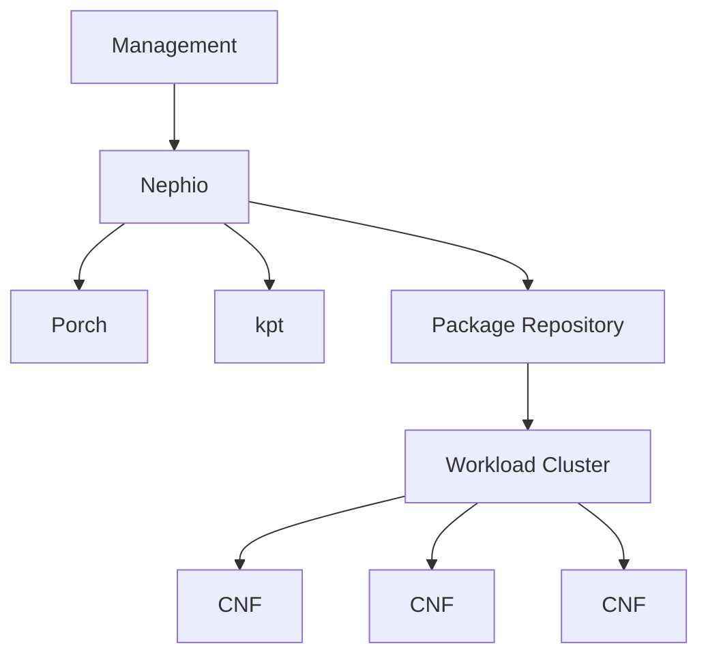
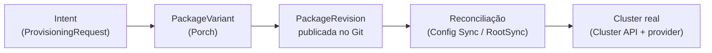

# Relatório Técnico — Parte 1
## Plataformas de Service Management and Orchestration (SMO) para Open RAN: uma análise do Nephio

> Curso CESAR — disciplina de redes Open RAN. Autor: Diego Abreu.
> Data: 2026-09-11. Fontes completas: [`docs/references.md`](../docs/references.md).

---

## 1. Introdução

O Open RAN redefine a arquitetura de acesso rádio ao desagregar funções tradicionalmente
monolíticas (O-RU, O-DU, O-CU) e ao introduzir interfaces abertas entre elas. Essa
desagregação, porém, só é operacionalmente viável se existir uma camada de gerência capaz de
orquestrar, configurar e manter o ciclo de vida de dezenas de componentes de múltiplos
fornecedores, rodando sobre infraestrutura de nuvem heterogênea. Essa camada é o **Service
Management and Orchestration (SMO)**, definido pela O-RAN ALLIANCE como o framework central de
gerência da arquitetura O-RAN.

Este relatório investiga o **Nephio**, uma plataforma de automação cloud-native mantida pela
Linux Foundation Networking, avaliando **até que ponto** ele implementa funções associadas ao
SMO e ao gerenciamento do O-Cloud — sem tratá-lo como *"o SMO oficial"* da O-RAN Alliance. A
formulação adotada, e sustentada com evidência ao longo do texto, é:

> *Nephio is a cloud-native automation and orchestration platform that can implement or support
> functions associated with the SMO and O-Cloud management architecture.*

Parte das afirmações aqui feitas são respaldadas por um **laboratório prático já em execução**
(não apenas leitura de documentação): um Management Cluster com Nephio R6 completo e um Workload
Cluster provisionado ao vivo via o fluxo O2 IMS do próprio Nephio. Essa base experimental é
detalhada na Parte 2 deste trabalho e referenciada aqui onde relevante.

## 2. Open RAN e o papel do SMO

A arquitetura O-RAN organiza o RAN em componentes desagregados — **O-RU**, **O-DU**, **O-CU**
(dividido em planos de controle e usuário) — conectados por interfaces abertas (F1, E1, Open
Fronthaul), e complementa essa desagregação com dois controladores de inteligência: o **Near-RT
RIC** (near real-time, hospeda xApps) e o **Non-RT RIC** (non real-time, hospeda rApps,
localizado dentro do SMO).

O **SMO** é o componente de topo dessa arquitetura. Segundo o O-RAN Software Community
(projeto OAM), o SMO *"terminates O1, O2 interfaces, and the A1 interface (in the Non-RealTime
RIC)"*. Suas responsabilidades incluem:

- **FCAPS** (Fault, Configuration, Accounting, Performance, Security) dos elementos RAN, via O1;
- **Gerenciamento do O-Cloud** — inventário, provisionamento e lifecycle da infraestrutura de
  nuvem e das NFs nela hospedadas — via O2 (O2 IMS + O2 DMS);
- hospedagem do **Non-RT RIC**, com distribuição de políticas via A1;
- **inventário e topologia** de toda a rede gerenciada;
- **orquestração ponta a ponta** de serviços e funções de rede.

Sem um SMO funcional, a promessa de "abertura e multi-fornecedor" do Open RAN não se sustenta
operacionalmente: seria necessário integrar manualmente dezenas de componentes heterogêneos.

## 3. Nephio

Nephio é um projeto **graduado da Linux Foundation Networking**, iniciado em 2022 como
colaboração entre a Linux Foundation e o Google Cloud. Sua missão declarada é entregar
*"carrier-grade, simple, open, Kubernetes-based cloud native intent automation and common
automation templates"* para simplificar a implantação e o gerenciamento de infraestrutura de
nuvem multi-fornecedor e de funções de rede em implantações de grande escala e de borda.

É essencial notar: **o núcleo do Nephio é agnóstico de telecom.** Ele é construído sobre três
pilares genéricos — Kubernetes como plano de controle, *Configuration as Data* (kpt/KRM) e
GitOps — e só se conecta ao domínio O-RAN por meio de **operadores e pacotes específicos**
(O2 IMS, FOCOM) que o próprio projeto Nephio desenvolve como *"a reference implementation of the
O-RAN Alliance's cloud-centric specifications"*, e cuja cobertura, pela própria documentação
oficial, é **parcial** (ver Seção 12).

## 4. Arquitetura

A arquitetura Nephio distribui responsabilidades entre dois tipos de cluster Kubernetes:

- **Management Cluster** — hospeda o *Nephio Core* (operadores e controllers), o **Porch**
  (API de orquestração de pacotes, descrita oficialmente como *"kpt-as-a-service"*), um
  repositório Git de pacotes, e o **Config Sync** (ferramenta GitOps) que reconcilia o próprio
  management cluster.
- **Workload Cluster(s)** — onde as CNFs efetivamente executam, recebendo configuração via
  GitOps a partir de um repositório de pacotes já "hydrated" (prontos para aplicação direta).

O **kpt** — *"a package-centric toolchain... for manipulating declarative Configuration as
Data"*, projeto CNCF Sandbox — fornece a unidade fundamental de trabalho: o **pacote**, um
diretório com um `Kptfile` e manifests KRM, transformável por *functions* compostas em um
*pipeline*. O **Porch** expõe essa capacidade como API Kubernetes nativa, introduzindo os
conceitos de `Repository`, `PackageRevision` (com ciclo de vida Draft→Proposed→Published) e
`PackageVariant`/`PackageVariantSet` (geração de variações de um pacote upstream para um ou
mais destinos). O **Config Sync**, por fim, fecha o loop GitOps: observa um repositório e aplica
automaticamente ao cluster qualquer mudança publicada — o mesmo padrão de *control loop* que o
próprio Kubernetes define oficialmente para seus controllers (*"tries to move the current
cluster state closer to the desired state"*).

O resultado é um fluxo de **automação orientada a intenção** (*intent-based automation*): uma
declaração de alto nível (o "intent") é traduzida, por uma cadeia de controllers, em pacotes
concretos, publicados em Git, e finalmente reconciliados como recursos Kubernetes reais — sem
que o operador manipule manifestos de baixo nível diretamente. Detalhamento completo em
[`docs/nephio-architecture.md`](../docs/nephio-architecture.md).

## 5. Serviços e funções de SMO disponibilizados

Com base na tabela função-a-função desenvolvida em
[`docs/nephio-vs-smo.md`](../docs/nephio-vs-smo.md), o Nephio disponibiliza, com graus de
maturidade distintos:

| Nível de cobertura | Funções |
|---|---|
| **Implementado e demonstrado** | Provisioning de infraestrutura (O2 IMS), lifecycle de deployment Kubernetes (instantiate/scale/update/recover/terminate), criação de O-Cloud Node Cluster |
| **Apoiado / parcial** | Configuration management (de pacotes K8s, não O1), orchestration (de pacotes, não de serviço multi-domínio), fault management (nível Kubernetes), inventory (de clusters/pacotes) |
| **Não implementado** | O1, monitoramento e telemetria nativos, Non-RT RIC, distribuição de políticas A1 |

## 6. Componentes O-RAN suportados

O laboratório prático instalou e validou, do lado Nephio, os seguintes componentes com relação
direta ao O-RAN: o operador **O2 IMS** (`o2ims-operator`, CRD `ProvisioningRequest`) e o
operador **FOCOM** (`focom-operator`, CRDs `FocomProvisioningRequest`, `OCloud`,
`TemplateInfo`). Nenhum componente de **Near-RT RIC**, **Non-RT RIC**, **O-DU/O-CU real** ou
**terminação O1** faz parte do Nephio Core ou foi instalado — o laboratório usa, no lugar de NFs
reais, um workload representativo (ver Parte 2).

## 7. Interfaces O1 e O2

**O1** — interface de gerência FCAPS entre o SMO e os elementos RAN (via NETCONF/YANG para
configuração e REST/VES para notificações). **O Nephio não implementa O1**: a descoberta
completa do cluster (76 CRDs) não encontrou nenhum componente relacionado, e a documentação
oficial do projeto não lista terminação O1 entre suas capacidades centrais. Essa função
pertence, no ecossistema O-RAN, ao projeto **O-RAN-SC OAM**.

**O2** — interface entre o SMO e o O-Cloud, dividida conceitualmente em **O2 IMS**
(infraestrutura: inventário, provisionamento, lifecycle de recursos de nuvem) e **O2 DMS**
(deployment: onboarding e lifecycle das NFs sobre essa infraestrutura). O Nephio R6 implementa
uma **PoC funcional de O2 IMS**: a CRD `ProvisioningRequest` (`o2ims.provisioning.oran.org/
v1alpha1`), reconciliada por um operador que cria um `PackageVariant`, o qual, através de
Porch/GitOps, materializa um `Cluster` (Cluster API) real. Esse fluxo foi **executado e
validado** no laboratório: `provisioningState: fulfilled`, cluster de 2 nós `Ready`. O2 DMS é
mais difuso — não existe uma API DMS rotulada separadamente; o mecanismo genérico de pacotes
cumpre esse papel de forma implícita. Análise completa em
[`docs/o1-o2-analysis.md`](../docs/o1-o2-analysis.md).

O próprio pacote O2 IMS do Nephio se declara *"work-in-progress in O-RAN standards... a PoC"*,
baseado no rascunho de especificação `O-RAN.WG6.TS.O-CLOUD-IM.0-R004-v03.00` — não uma
implementação certificada.

## 8. Provisionamento e orquestração

O mecanismo de provisionamento do Nephio segue a cadeia:

No laboratório, essa cadeia foi disparada por um único objeto declarativo — um
`ProvisioningRequest` com `templateName: nephio-workload-cluster` — e resultou, sem intervenção
manual em nível de infraestrutura, em um segundo cluster Kubernetes de 2 nós, completamente
operacional. A orquestração, portanto, ocorre em dois níveis: **orquestração de pacotes**
(Porch decide como compor/publicar um pacote a partir de um template e parâmetros) e
**orquestração de infraestrutura** (Cluster API decide como materializar essa declaração em
máquinas/containers reais).

## 9. Gerenciamento do O-Cloud

O Nephio oferece, através do par O2 IMS + Cluster API, a capacidade de **criar** um O-Cloud Node
Cluster sob demanda — a própria documentação oficial confirma esse escopo específico ("R4...
supports the O-Cloud Node Cluster creation as part of the O-Cloud Cluster Lifecycle Management
service"). O que **não** está coberto: inventário de hardware/aceleradores, gerenciamento de
capacidade em nível de NFVI, e a federação real entre múltiplos O-Clouds via FOCOM (que, no
laboratório, foi simplificada para um único cluster de management, sem o cluster SMO separado
do fluxo FOCOM canônico).

## 10. Ciclo de vida de Network Functions

O laboratório demonstrou cinco fases do ciclo de vida sobre um workload representativo:
**instantiate** (deployment inicial), **scale** (1→3 réplicas), **update** (rollout declarativo
com nova revisão), **recover** (reconciliação automática após falha simulada) e **terminate**
(remoção completa). É importante frisar a distinção: esse é o ciclo de vida **do Kubernetes**
(Deployment/ReplicaSet), não um ciclo de vida *NF-aware* orientado por KPIs de rede ou por
interfaces de gerência O-RAN — nenhuma NF real foi usada nesta etapa (ver Parte 2 para os
detalhes com as CNFs simuladas O-RAN).

## 11. Monitoramento, telemetria e gerenciamento de falhas

O Nephio **não inclui** um stack de monitoramento ou telemetria nativo — não há coleta de KPI
O1/PM, nem suporte a VES. O que existe é o mecanismo padrão do Kubernetes: `kubectl get/describe/
logs`, eventos do cluster, e (opcionalmente) `metrics-server`/Prometheus, nenhum dos quais foi
instalado no laboratório por decisão explícita de manter o consumo de recursos baixo. O
gerenciamento de falhas observado é, igualmente, o *self-healing* padrão do Kubernetes
(ReplicaSet recriando um pod deletado) — não uma função de *fault management* O-RAN, que exigiria
alarmes O1, correlação de eventos e um NMS de fato.

## 12. Limitações

1. Nephio, tal como avaliado, **não implementa O1, Non-RT RIC nem distribuição de políticas
   A1**.
2. A implementação de **O2 é uma PoC** declarada pelo próprio projeto, não uma certificação
   O-RAN.
3. **Monitoramento e telemetria** de rede não são nativos; dependem de integração externa.
4. O **fault management** demonstrável é o do Kubernetes, não FCAPS-F do O-RAN.
5. O **O-Cloud gerenciado** no laboratório é um cluster Kubernetes local (kind + Cluster API com
   provider Docker) — sem hardware, rede de transporte ou inventário O2 reais.
6. A arquitetura de **federação FOCOM** (cluster SMO separado) não foi replicada
   integralmente, por restrição de RAM (16 GB) — foi usado o caminho direto de provisionamento.

## 13. Comparação com outras soluções

Frente a ONAP, ETSI OSM, O-RAN-SC SMO e OpenStack Tacker, o Nephio se destaca por ser
**nativamente Kubernetes/GitOps** e por caber, com folga medida (~3,6 GiB de um orçamento de
16 GB), em um laboratório 100% local — enquanto as demais soluções, segundo suas próprias
documentações de referência, tipicamente demandam dezenas de GB de RAM, múltiplas VMs, e (no
caso do Tacker) uma instalação OpenStack completa — indisponível neste ambiente. Em
contrapartida, nenhuma das alternativas mais pesadas tem, no Nephio, sua cobertura de O1 e
Non-RT RIC replicada. Tabela completa em
[`docs/tool-comparison.md`](../docs/tool-comparison.md).

## 14. Conclusão

O Nephio comprova ser uma **plataforma de automação cloud-native efetiva**, capaz de sustentar,
com evidência prática e não apenas teórica, um subconjunto real e bem definido das funções
associadas ao SMO: provisionamento de infraestrutura via O2 IMS, orquestração de pacotes via
GitOps, e lifecycle management de deployments Kubernetes. Ele **não é**, e não se propõe a ser,
uma implementação completa e certificada do SMO da O-RAN Alliance — lacunas em O1, Non-RT RIC,
telemetria e política são reais e foram documentadas sem eufemismo. Essa caracterização
precisa — nem subestimar nem superestimar a ferramenta — é a base sobre a qual a Parte 2 deste
trabalho constrói o experimento prático de provisionamento e gerenciamento de uma pilha Open
RAN simulada.

## 15. Referências

Ver [`docs/references.md`](../docs/references.md) para a lista completa (26 fontes, com URL,
título, seção e uso). Fontes primárias mais citadas neste relatório: Nephio Documentation
(`docs.nephio.org`), Linux Foundation / LF Networking, O-RAN ALLIANCE (`o-ran.org`, WG6),
O-RAN Software Community (wiki OAM/SMO), kpt.dev e Kubernetes Documentation
(`kubernetes.io`).
