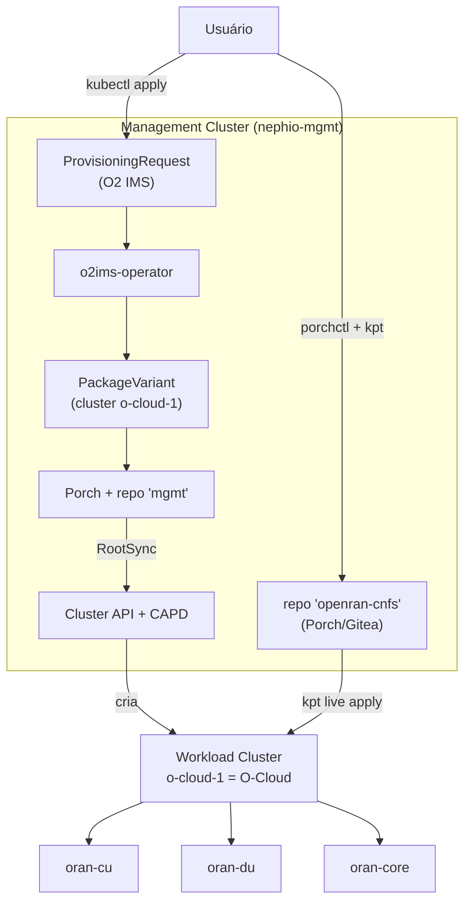

# Relatório Técnico — Parte 2
## Provisionamento e gerenciamento de uma pilha Open RAN simulada com Nephio

> Curso CESAR — disciplina de redes Open RAN. Autor: Diego Abreu.
> Data: 2026-09-11. Evidência completa: [`evidence/`](../evidence/), [`results/experiments.csv`](../results/experiments.csv).

---

## 1. Objetivo

Usar o **Nephio** (analisado teoricamente na Parte 1) para, na prática, **provisionar e
gerenciar** uma pilha Open RAN simulada — três Network Functions representativas (`oran-cu`,
`oran-du`, `oran-core`) — sobre um O-Cloud provisionado pelo próprio Nephio via O2 IMS,
demonstrando os mecanismos reais de **provisioning, configuration management, orchestration** e
**lifecycle management**, com evidência mensurável (tempo, RAM, CPU) de cada operação.

## 2. Ambiente experimental

| Item | Valor |
|---|---|
| Host | Windows 11 Enterprise, 16 GB RAM, WSL2 + Ubuntu 26.04 LTS |
| Runtime | Docker Engine 29.8.0 nativo no WSL2 |
| Kubernetes | **kind** — management cluster `nephio-mgmt` (K8s v1.32.0, 1 nó) + workload cluster `o-cloud-1` (K8s v1.31.0, 2 nós) |
| Nephio | **R6 (`v6.0.0`)**, catálogo `v6`, instalação mínima (34/35 pods, 76 CRDs) |
| Ferramentas de pacote | kpt v1.0.0, Porch v1.5.6, `porchctl` v1.5.6 |
| Limite de RAM configurado | `.wslconfig`: `memory=10GB`, `processors=6`, `swap=4GB` |

Detalhes completos: [`docs/environment-assessment.md`](../docs/environment-assessment.md) e
[`docs/02-nephio-installation.md`](../docs/02-nephio-installation.md).

## 3. Arquitetura

- **Camada 1 (infraestrutura):** O2 IMS provisiona o `o-cloud-1` — já demonstrado e evidenciado
  na Parte 1 / [`docs/05-experiment-report.md`](../docs/05-experiment-report.md).
- **Camada 2 (workload/NF), foco desta Parte 2:** as 3 CNFs chegam ao `o-cloud-1` via um pacote
  kpt publicado no Porch (repositório dedicado `openran-cnfs`), não por `kubectl apply` direto —
  ver [`docs/provisioning-flow.md`](../docs/provisioning-flow.md).

## 4. Ferramentas

| Ferramenta | Papel nesta Parte 2 |
|---|---|
| **kpt** | autoria do pacote (`lab/nephio/openran-cnfs`), pipeline de funções, `kpt live apply` (reconciliação declarativa com inventário) |
| **Porch / `porchctl`** | ciclo de vida do pacote (Draft → Proposed → Published), repositório dedicado |
| **kind + Cluster API + CAPD** | criação do `o-cloud-1` (via O2 IMS, Parte 1) |
| **kubectl** | operações imperativas de comparação (scale, delete pod) e validação |
| **FastAPI/Python + Docker** | as 3 CNFs simuladas |

## 5. Network Functions utilizadas

**`oran-cu`, `oran-du`, `oran-core`** — workloads representativos (FastAPI, ~30–50 MiB de RAM
cada), **não** NFs O-RAN reais. Cada uma expõe `/health`, `/config` (GET/PUT/POST), `/metrics`
(Prometheus). Detalhes e justificativa em [`lab/cnfs/README.md`](../lab/cnfs/README.md) e
avaliação de substituição por NFs reais em
[`docs/real-nf-extension.md`](../docs/real-nf-extension.md) (não realizada — RAM insuficiente
para um core 5G real ao lado do Nephio completo).

## 6. Provisionamento

Fluxo completo demonstrado em [`docs/provisioning-flow.md`](../docs/provisioning-flow.md):
pacote kpt autoral → `porchctl rpkg init/pull/push/propose/approve` → `PackageRevision`
Published no repositório `openran-cnfs` → `kpt live apply` no `o-cloud-1` (com `ResourceGroup`
como inventário declarativo). **Experimento 1:** provisionamento das 3 CNFs do zero em
**20,4 s** (`results/experiments.csv`).

## 7. Configuration Management

Duas camadas distintas, deliberadamente **não confundidas**:

1. **Configuração operacional da NF** (análoga ao que O1/NETCONF faria com uma NF real): API
   própria `/config` de cada CNF. **Experimento 2:** `oran-du.cell_id` `1 → 2` via `PUT /config`,
   em **0,7 s**.
2. **Configuração de implantação (pacote/GitOps):** alterar o `ConfigMap`/`Deployment` no pacote
   autoral e republicar via Porch. Usado no Experimento 5 (upgrade) — ver §8.

**Achado real registrado:** mudar **apenas** o `ConfigMap` consumido via `envFrom` **não**
dispara um novo rollout do `Deployment` — o hash do pod template não muda, então o Kubernetes
não cria novos Pods, e os Pods já existentes mantêm as variáveis de ambiente antigas até
reiniciarem por outro motivo. Documentado e corrigido (ver §11) adicionando um carimbo de
versão em `spec.template.metadata.annotations`, que força a criação de um novo `ReplicaSet`.

## 8. Lifecycle Management

| Operação | Experimento | Duração | Resultado |
|---|---|---|---|
| Instantiate | 1 | 20,4 s | 3/3 NFs `Running` |
| Scale (1→2) | 3 | 5,7 s | `oran-cu` 2/2 `Running` |
| Update/Upgrade (v1→v2) | 5 | 15,0 s | `revision` 1→2, rollout real, `/health.nf_version=v2` |
| Recover (falha) | 4 | 3,9 s | pod deletado → novo pod `Running`, nome diferente |
| Terminate | 6 | 10,8 s | `oran-core` removido via **prune** do `kpt live apply` (não `kubectl delete` manual) |

Todos os 6 experimentos: **SUCCESS** (`results/experiments.csv`).

## 9. Orquestração

A orquestração observada opera em duas granularidades:
- **Porch/kpt** decide *como compor e publicar* um pacote (upstream → downstream, mutators).
- **Kubernetes** (ReplicaSet/Deployment controllers) decide *como manter* o estado declarado
  (reconciliação contínua) — sem intervenção manual, mesmo quando o pacote não muda (Experimento
  4).

**Achado real registrado (bug de engenharia, corrigido):** a primeira versão do script de
entrega (`deploy-cnfs-via-porch.sh`) recriava o diretório de trabalho local — e portanto o
inventário (`ResourceGroup`) — a **cada chamada**, o que fazia o `kpt live apply` gerar um
`inventory-id` novo toda vez e, consequentemente, **recusar tocar** nos recursos já existentes
(`policy: MustMatch`, `status: NoMatch`) — o Experimento 5 falhou silenciosamente duas vezes
antes dessa causa ser isolada e corrigida (persistindo o inventário entre chamadas). Este é
exatamente o tipo de comportamento de "propriedade declarativa" que diferencia orquestração
GitOps de um simples script de `kubectl apply`.

## 10. Monitoramento

Opção leve (sem Prometheus/Grafana) — ver [`docs/monitoring.md`](../docs/monitoring.md):
`/metrics` de cada CNF (formato Prometheus: `nf_up`, `nf_requests_total`,
`nf_config_version`, `nf_restart_count`), `docker stats`/`free -h` para custo de host, logs e
eventos do Kubernetes. `metrics-server` inicialmente não instalado (decisão explícita) —
posteriormente instalado no `o-cloud-1` como melhoria de baixo custo dentro do orçamento de
16 GB; ver [`docs/improvements-16gb.md`](../docs/improvements-16gb.md) §1 para `kubectl top`
real por nó/pod.

## 11. Falhas e recuperação

Duas classes de "falha" foram tratadas neste trabalho, e são deliberadamente distinguidas:

1. **Falha simulada de Pod** (Experimento 4): `kubectl delete pod` → ReplicaSet recria em 3,9 s.
   Isto é *self-healing* do Kubernetes (desired state vs. actual state), **não** healing de uma
   NF de telecom (sem estado de sessão, sem re-registro em interfaces O-RAN).
2. **Falhas de engenharia reais, encontradas e corrigidas durante os experimentos** (não
   simuladas de propósito, mas genuínas): (a) `push` do Porch sem `pull` prévio (metadados
   ausentes); (b) `ConfigMap`-only change não dispara rollout; (c) inventário do `kpt`
   recriado a cada chamada, quebrando a reconciliação de recursos já existentes. As três foram
   diagnosticadas com evidência (logs reais) e corrigidas nos scripts — documentadas aqui e em
   [`docs/provisioning-flow.md`](../docs/provisioning-flow.md) em vez de escondidas.

## 12. Resultados

`results/experiments.csv` — **6/6 experimentos com status `success`**, tempos entre 0,7 s
(config) e 20,4 s (provisionamento completo do zero). Todas as validações automáticas
(`scripts/validate-lab.sh`, herdadas da Parte 1) continuam passando (10/10 `PASS`).

## 13. Uso de CPU e memória

| Componente | RAM medida |
|---|---|
| `nephio-mgmt` (Nephio R6 completo) | ~3,7–3,9 GiB |
| `o-cloud-1` (2 nós, K8s) | ~1,4 GiB |
| 3 CNFs simuladas (juntas) | < 200 MiB (dentro dos limites `128Mi`/NF) |
| **Total dentro do WSL** | **~3,9 GiB usados / 9,7 GiB configurados (~5,8 GiB *available*)** |
| CPUs alocadas ao WSL | 6 (de 12 threads da máquina) |

O laboratório inteiro (management + O-Cloud + 3 CNFs + Porch + Gitea + Cluster API) ficou
**bem abaixo** da meta de 10–12 GB do enunciado, com folga para os experimentos.

## 14. Limitações

1. **CNFs simuladas, não NFs O-RAN reais** — sem protocolos de rádio, planos de
   usuário/controle, ou interfaces F1/E1/E2.
2. ~~**Sem GitOps contínuo no `o-cloud-1`** — a entrega usa `kpt live apply` sob demanda, não um
   `RootSync`/Config Sync observando o repositório continuamente~~ — **superado**: ver
   [`docs/improvements-16gb.md`](../docs/improvements-16gb.md) §2 (RootSync `openran-cnfs`
   instalado no `o-cloud-1`, com prova de auto-reconciliação sem `kpt live apply` manual).
   Mantido riscado aqui por fidelidade histórica ao escopo original desta Parte 2
   (decisão registrada em `docs/provisioning-flow.md` §4).
3. **Sem O1** — configuração operacional via API REST própria da NF, não NETCONF/YANG.
4. **Sem monitoramento O-RAN** (VES, PM Jobs) — apenas `/metrics` Prometheus-like e `kubectl`.
5. **`cell_id`/config de domínio não propaga de volta ao pacote** — a mudança via `/config` (API
   da NF) e a mudança via pacote (Porch) são caminhos independentes; uma alteração feita por um
   não aparece automaticamente no outro (seria necessário um controller adicional para
   sincronizar os dois, fora do escopo).
6. Ver também as limitações do O2 IMS/O-Cloud herdadas da Parte 1
   (`docs/05-experiment-report.md` §11) — o `o-cloud-1` não sobrevive a um restart da VM do
   WSL2 sem re-provisionamento.

## 15. Conclusão

O experimento demonstrou, com evidência mensurável e reprodutível, que o Nephio consegue
**orquestrar o ciclo de vida completo de Network Functions cloud-native** — provisionamento,
configuração, escala, atualização, recuperação e terminação — usando seus mecanismos nativos
(kpt, Porch, reconciliação declarativa), não apenas `kubectl apply`. Dois bugs de engenharia
reais foram encontrados e corrigidos ao longo do processo (rollout não disparado por mudança de
ConfigMap; inventário do kpt não persistente entre chamadas), reforçando que este foi um
experimento **prático de verdade**, não um roteiro follow-along. As limitações — ausência de
O1, de NFs reais, de GitOps contínuo no workload cluster — são as mesmas fronteiras já
mapeadas com rigor na Parte 1, agora confirmadas na prática.
