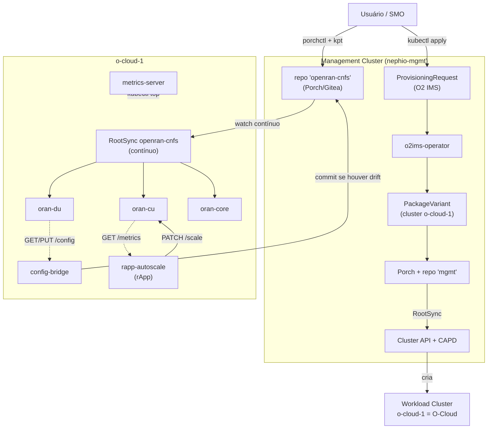

# Relatório Técnico — Parte 2
## Provisionamento e gerenciamento de uma pilha Open RAN simulada com Nephio

> Curso CESAR — disciplina de redes Open RAN. Autor: Diego Abreu.
> Data: 2026-09-25. Evidência completa: [`evidence/`](../evidence/), [`results/experiments.csv`](../results/experiments.csv).

---

## 1. Objetivo

Usar o **Nephio** (analisado teoricamente na Parte 1) para, na prática, **provisionar e
gerenciar** uma pilha Open RAN simulada — três Network Functions representativas (`oran-cu`,
`oran-du`, `oran-core`) — sobre um O-Cloud provisionado pelo próprio Nephio via O2 IMS,
demonstrando os mecanismos reais de **provisioning, configuration management, orchestration,
monitoring, lifecycle management** e uma primeira função de **Non-RT RIC (rApp)**, com evidência
mensurável (tempo, RAM, CPU) de cada operação.

## 2. Ambiente experimental

| Item | Valor |
|---|---|
| Host | Windows 11 Enterprise, 16 GB RAM, WSL2 + Ubuntu 26.04 LTS |
| Runtime | Docker Engine 29.8.0 nativo no WSL2 |
| Kubernetes | **kind** — management cluster `nephio-mgmt` (K8s v1.32.0, 1 nó) + workload cluster `o-cloud-1` (K8s v1.31.0, 2 nós) |
| Nephio | **R6 (`v6.0.0`)**, catálogo `v6`, instalação mínima (34/35 pods, 76 CRDs) |
| Ferramentas de pacote | kpt v1.0.0, Porch v1.5.6, `porchctl` v1.5.6 |
| Limite de RAM configurado | `.wslconfig`: `memory=10GB`, `processors=6`, `swap=4GB` |

Detalhes completos: [`docs/environment-assessment.md`](../docs/environment-assessment.md) e
[`docs/02-nephio-installation.md`](../docs/02-nephio-installation.md).

## 3. Arquitetura

- **Camada 1 (infraestrutura):** O2 IMS provisiona o `o-cloud-1` — já demonstrado e evidenciado
  na Parte 1 / [`docs/05-experiment-report.md`](../docs/05-experiment-report.md).
- **Camada 2 (workload/NF):** as 3 CNFs chegam ao `o-cloud-1` via um pacote kpt publicado no
  Porch (repositório dedicado `openran-cnfs`), reconciliado **continuamente** por um `RootSync`
  no próprio `o-cloud-1` — não por `kubectl apply` avulso nem por `kpt live apply` sob demanda —
  ver [`docs/provisioning-flow.md`](../docs/provisioning-flow.md).
- **Camada 3 (operação):** `metrics-server` (monitoramento real por nó/pod), `config-bridge`
  (fecha o loop configuração-da-NF ↔ pacote) e `rapp-autoscale` (política de capacidade
  não-tempo-real, a função de Non-RT RIC deste laboratório) rodam dentro do `o-cloud-1`,
  consumindo as mesmas APIs que as camadas 1 e 2 já expõem.

## 4. Ferramentas

| Ferramenta | Papel nesta Parte 2 |
|---|---|
| **kpt** | autoria do pacote (`lab/nephio/openran-cnfs`), pipeline de funções, inventário declarativo (`ResourceGroup`) |
| **Porch / `porchctl`** | ciclo de vida do pacote (Draft → Proposed → Published), repositório dedicado |
| **Config Sync / `RootSync`** | reconciliação GitOps contínua do repositório `openran-cnfs` dentro do próprio `o-cloud-1` |
| **kind + Cluster API + CAPD** | criação do `o-cloud-1` (via O2 IMS) |
| **metrics-server** | métricas reais de CPU/RAM por nó e por pod (`kubectl top`) |
| **kubectl** | operações imperativas de comparação (scale, delete pod) e validação |
| **FastAPI/Python + Docker** | as 3 CNFs simuladas, o `config-bridge` e o `rapp-autoscale` |

## 5. Network Functions utilizadas

**`oran-cu`, `oran-du`, `oran-core`** — workloads representativos (FastAPI, ~30–50 MiB de RAM
cada), **não** NFs O-RAN reais. Cada uma expõe `/health`, `/config` (GET/PUT/POST), `/metrics`
(Prometheus). A configuração de domínio de `oran-du` (`plmn_id`, `cell_id`, `tx_power_dbm`,
`du_id`) é lida do `ConfigMap` do pacote, o que permite que o `config-bridge` (§9) saiba qual é o
"estado publicado" ao decidir se precisa corrigir um desvio. Detalhes e justificativa em
[`lab/cnfs/README.md`](../lab/cnfs/README.md) e avaliação de substituição por NFs reais em
[`docs/real-nf-extension.md`](../docs/real-nf-extension.md) (não realizada — RAM insuficiente
para um core 5G real ao lado do Nephio completo).

## 6. Provisionamento

Fluxo completo demonstrado em [`docs/provisioning-flow.md`](../docs/provisioning-flow.md):
pacote kpt autoral → `porchctl rpkg init/pull/push/propose/approve` → `PackageRevision`
Published no repositório `openran-cnfs` → reconciliação declarativa no `o-cloud-1`.
**Experimento 1:** provisionamento das 3 CNFs do zero em **20,4 s** (`results/experiments.csv`).

## 7. Configuration Management

Duas camadas distintas, deliberadamente **não confundidas**, e uma ponte real entre elas:

1. **Configuração operacional da NF** (análoga ao que O1/NETCONF faria com uma NF real): API
   própria `/config` de cada CNF. **Experimento 2:** `oran-du.cell_id` `1 → 2` via `PUT /config`,
   em **0,7 s**.
2. **Configuração de implantação (pacote/GitOps):** alterar o `ConfigMap`/`Deployment` no pacote
   autoral e republicar via Porch. Usado no Experimento 5 (upgrade) — ver §8.
3. **`config-bridge` — a ponte entre as duas.** Um poller que compara o `/config` ao vivo de
   `oran-du` com o `ConfigMap` publicado no pacote e comita a correção quando há divergência —
   fechando o loop entre a camada 1 e a camada 2. O `RootSync` (§9) reconcilia o resto sozinho.
   **Experimento 9:** `PUT /config {"cell_id": 7}` (contornando o GitOps deliberadamente) →
   drift detectado → commit → `CFG_CELL_ID=7` confirmado no `ConfigMap` real do cluster, em
   **29 s** de ponta a ponta.

**Achado real registrado:** mudar **apenas** o `ConfigMap` consumido via `envFrom` **não**
dispara um novo rollout do `Deployment` — o hash do pod template não muda, então o Kubernetes
não cria novos Pods, e os Pods já existentes mantêm as variáveis de ambiente antigas até
reiniciarem por outro motivo. Corrigido adicionando um carimbo de versão em
`spec.template.metadata.annotations`, que força a criação de um novo `ReplicaSet` (ver §9).

**Bug real encontrado e corrigido no `config-bridge`:** a primeira versão serializava o YAML
sem forçar aspas; o PyYAML emitiu `CFG_PLMN_ID: 00101` sem aspas — um padrão que o resolvedor de
tipos do YAML 1.1 reconhece como número, e que na releitura virou o inteiro `101` (perdendo o
zero à esquerda de `"00101"`). Isso causava um **loop de auto-correção a cada 15 s**. Corrigido
forçando `default_style="'"` no `yaml.dump` — igual ao que o Kubernetes já faz implicitamente
(todo valor de `ConfigMap.data` é string).

## 8. Lifecycle Management

| Operação | Experimento | Duração | Resultado |
|---|---|---|---|
| Instantiate | 1 | 20,4 s | 3/3 NFs `Running` |
| Scale (1→2) | 3 | 5,7 s | `oran-cu` 2/2 `Running` |
| Update/Upgrade (v1→v2) | 5 | 15,0 s | `revision` 1→2, rollout real, `/health.nf_version=v2` |
| Recover (falha) | 4 | 3,9 s | pod deletado → novo pod `Running`, nome diferente |
| Terminate | 6 | 10,8 s | `oran-core` removido via **prune** do `kpt live apply` (não `kubectl delete` manual) |

Todos os 6 experimentos formais de lifecycle: **SUCCESS** (`results/experiments.csv`).

## 9. Orquestração

A orquestração observada opera em três granularidades:

- **Porch/kpt** decide *como compor e publicar* um pacote (upstream → downstream, mutators).
- **Config Sync/`RootSync`** decide *quando* o que está publicado no repositório deve estar
  refletido no cluster — de forma **contínua**, não sob demanda. **Experimento 8:** publicou-se
  uma nova revisão do pacote no Porch (`nf-version: v2→v3`) **sem** rodar nenhum `kpt live apply`
  manual — o RootSync detectou e aplicou sozinho em **19 s** (`commit=1bdae53d` →
  `oran-cu.nf-version=v3`).
- **Kubernetes** (ReplicaSet/Deployment controllers) decide *como manter* o estado declarado
  (reconciliação contínua) — sem intervenção manual, mesmo quando o pacote não muda (Experimento
  4).

**Achado real registrado (bug de engenharia, corrigido):** a primeira versão do script de
entrega (`deploy-cnfs-via-porch.sh`) recriava o diretório de trabalho local — e portanto o
inventário (`ResourceGroup`) — a **cada chamada**, o que fazia o `kpt live apply` gerar um
`inventory-id` novo toda vez e, consequentemente, **recusar tocar** nos recursos já existentes
(`policy: MustMatch`, `status: NoMatch`) — o Experimento 5 falhou silenciosamente duas vezes
antes dessa causa ser isolada e corrigida (persistindo o inventário entre chamadas). Este é
exatamente o tipo de comportamento de "propriedade declarativa" que diferencia orquestração
GitOps de um simples script de `kubectl apply`.

## 10. Monitoramento

Duas camadas, deliberadamente leves — ver [`docs/monitoring.md`](../docs/monitoring.md):

1. **Aplicação (NF):** `/metrics` de cada CNF (formato Prometheus: `nf_up`,
   `nf_requests_total`, `nf_config_version`, `nf_restart_count`).
2. **Infraestrutura (cluster):** `metrics-server` instalado no `o-cloud-1` (manifesto oficial +
   patch `--kubelet-insecure-tls`, padrão em qualquer cluster kind) — **Experimento 7:**
   `kubectl top nodes/pods` retorna CPU/RAM reais por nó e por pod, com custo de ~15 MiB de RAM.

Sem Prometheus/Grafana nem telemetria O-RAN (VES, PM Jobs) — decisão explícita de orçamento;
`docker stats`/`free -h` complementam para custo de host.

## 11. Non-RT RIC — `rapp-autoscale`

Um **rApp simulado**: roda no Non-RT RIC, que é parte do próprio SMO (diferente de um xApp, que
rodaria no Near-RT RIC e falaria E2 com os "E2 Nodes" — protocolo que estas CNFs simuladas não
implementam; simular isso seria inventar uma interface inexistente no laboratório).

`rapp-autoscale` é um poller Python (não um operador `kopf`/`controller-runtime` — o estado
observado, o `/metrics` da NF, não é um recurso do Kubernetes) que a cada **30 s**
(deliberadamente não-tempo-real — O-RAN define rApp como >1 s, xApp como 10 ms–1 s) lê a taxa de
requisições de `oran-cu` e aplica uma política de capacidade: `rate > 1,0 req/s` → escala para
cima; `rate < 0,1 req/s` → escala para baixo (faixa `[1..3]` réplicas), via PATCH direto no
subrecurso `/scale` — simplificação documentada, já que não há Near-RT RIC real neste laboratório
para publicar uma policy A1. RBAC mínimo: `ServiceAccount` escopado só ao `Deployment/oran-cu`.

**Experimento 10:** 300 requisições de carga em `oran-cu` (5,99 s) elevam a taxa a
**10,27 req/s**, disparando `DECISAO rApp: replicas 1 -> 2` e o PATCH correspondente.

**Achado real — conflito de autoridade entre GitOps e controle imperativo:** o PATCH aplicava
`replicas:2` com sucesso (`200`), mas a réplica voltava a 1 segundos depois — o pacote no Git
ainda declarava `replicas: 1`, e o `RootSync` (§9) reconciliava de volta a cada ciclo. Corrigido
removendo o campo `replicas` do pacote: como `kpt live apply` e o reconciler do Config Sync usam
*server-side apply*, nenhum dos dois reivindica o campo quando ausente, deixando o
`rapp-autoscale` como dono exclusivo — o mesmo padrão usado quando um **HPA coexiste com GitOps**
na vida real (Argo CD chama isso de `ignoreDifferences`).

## 12. Falhas e recuperação

Duas classes de "falha" foram tratadas neste trabalho, e são deliberadamente distinguidas:

1. **Falha simulada de Pod** (Experimento 4): `kubectl delete pod` → ReplicaSet recria em 3,9 s.
   Isto é *self-healing* do Kubernetes (desired state vs. actual state), **não** healing de uma
   NF de telecom (sem estado de sessão, sem re-registro em interfaces O-RAN).
2. **Falhas de engenharia reais, encontradas e corrigidas ao longo do trabalho** (não simuladas
   de propósito, mas genuínas): (a) `push` do Porch sem `pull` prévio; (b) `ConfigMap`-only
   change não dispara rollout (§7); (c) inventário do `kpt` recriado a cada chamada (§9); (d)
   YAML sem aspas quebrando o `config-bridge` (§7); (e) conflito de autoridade GitOps × rApp
   (§11) — ao todo, **11 bugs de engenharia reais** documentados e corrigidos em todo o trabalho,
   nunca escondidos.

## 13. Resultados

`results/experiments.csv` + evidências de §9/§11 — **10/10 experimentos executados com sucesso**
(os 6 formais de lifecycle mais os 4 de orquestração/monitoramento/Non-RT RIC), tempos entre
0,7 s (config) e 30 s (ciclo de decisão do rApp). Validação automática
(`scripts/validate-lab.sh`): **15/15 checagens PASS**, cobrindo desde a existência dos clusters
até o estado de cada um dos componentes de §9–§11.

## 14. Uso de CPU e memória

| Componente | RAM medida |
|---|---|
| `nephio-mgmt` (Nephio R6 completo) | ~3,7–3,9 GiB |
| `o-cloud-1` (2 nós, K8s) | ~2,3 GiB |
| 3 CNFs simuladas (juntas) | < 200 MiB (dentro dos limites `128Mi`/NF) |
| `metrics-server` + `config-bridge` + `rapp-autoscale` (juntos) | ~130 MiB |
| **Total dentro do WSL** | **~6,4 GiB usados / 9,7 GiB configurados** |
| CPUs alocadas ao WSL | 6 (de 12 threads da máquina) |

O laboratório inteiro (management + O-Cloud + 3 CNFs + Porch + Gitea + Cluster API +
monitoramento + rApp) ficou **bem abaixo** da meta de 10–12 GB do enunciado, com folga real.

## 15. Non-RT RIC e Near-RT RIC — o que fica de fora

Este trabalho cobre o ângulo de **orquestração cloud-native** do SMO (Nephio: pacotes, GitOps,
O2 IMS) e uma primeira função de **Non-RT RIC** (o `rapp-autoscale`). Deliberadamente fora de
escopo:

- **O1** (FCAPS via NETCONF/YANG) — configuração operacional aqui é feita por uma API REST
  própria da NF, não por NETCONF/YANG contra um elemento gerenciado real.
- **A1/Near-RT RIC como plataforma** — o `rapp-autoscale` aplica sua decisão diretamente via API
  do Kubernetes, não publica uma *policy* A1 para um Near-RT RIC real (que não existe neste
  laboratório).
- **xApp/E2** — exigiria simular um Near-RT RIC completo e o protocolo E2AP entre RIC e "E2
  Nodes" (O-CU/O-DU), que as CNFs simuladas não implementam. Simular isso seria inventar uma
  interface inexistente no laboratório — por isso a decisão consciente de não fazê-lo.

## 16. Limitações

1. **CNFs simuladas, não NFs O-RAN reais** — sem protocolos de rádio, planos de
   usuário/controle, ou interfaces F1/E1/E2 (avaliação de free5GC/UERANSIM/OAI em
   `docs/real-nf-extension.md` — não coube em 16 GB ao lado do Nephio completo).
2. **Sem O1** — configuração operacional via API REST própria da NF, não NETCONF/YANG (§15).
3. **Sem A1/Near-RT RIC real, sem xApp/E2** — `rapp-autoscale` (§11) implementa a *forma* de uma
   função de Non-RT RIC, não a plataforma nem o protocolo A1 (§15).
4. **`config-bridge` cobre só `oran-du`/`cell_id`** — generalizável, mas não aplicado às demais
   NFs/campos.
5. **Sem telemetria O-RAN** (VES, PM Jobs) — apenas `/metrics` Prometheus-like e `kubectl top`.
6. Ver também as limitações do O2 IMS/O-Cloud herdadas da Parte 1
   (`docs/05-experiment-report.md` §11) — o `o-cloud-1` não sobrevive a um restart abrupto da VM
   do WSL2 sem re-provisionamento (CAPD + cgroup v2 do WSL2).

## 17. Conclusão

O experimento demonstrou, com evidência mensurável e reprodutível, que o Nephio consegue
**orquestrar o ciclo de vida completo de Network Functions cloud-native** — provisionamento,
configuração, escala, atualização, recuperação e terminação — usando seus mecanismos nativos
(kpt, Porch, GitOps contínuo), não apenas `kubectl apply`. Além disso, o laboratório demonstra
monitoramento real por métrica, uma ponte funcional entre configuração de NF e pacote GitOps, e
uma primeira função de Non-RT RIC (rApp) que decide e age sozinha a partir de telemetria —
incluindo um achado genuíno de sistemas distribuídos (conflito de autoridade entre GitOps
declarativo e controle imperativo, e sua correção). **11 bugs de engenharia reais** foram
encontrados e corrigidos ao longo do processo, reforçando que este foi um experimento
**prático de verdade**, não um roteiro follow-along. As limitações — ausência de O1, de NFs
reais, de xApp/E2, de federação FOCOM — são as mesmas fronteiras já mapeadas com rigor na
Parte 1, agora confirmadas na prática.
